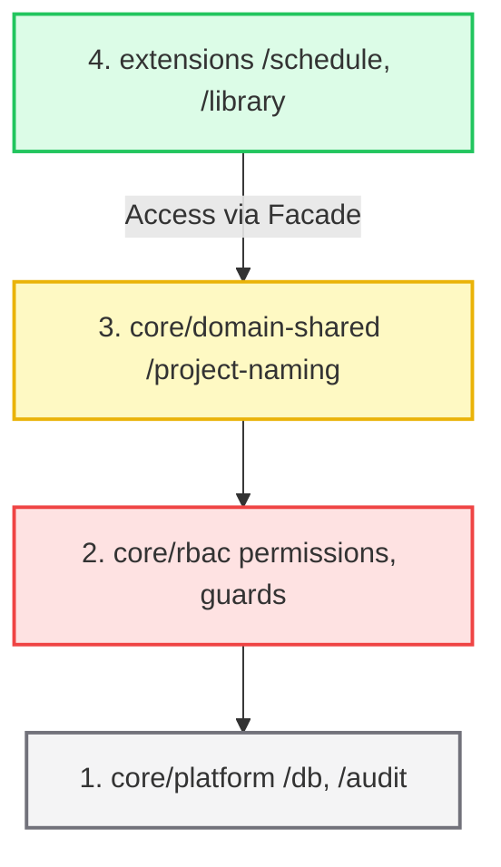
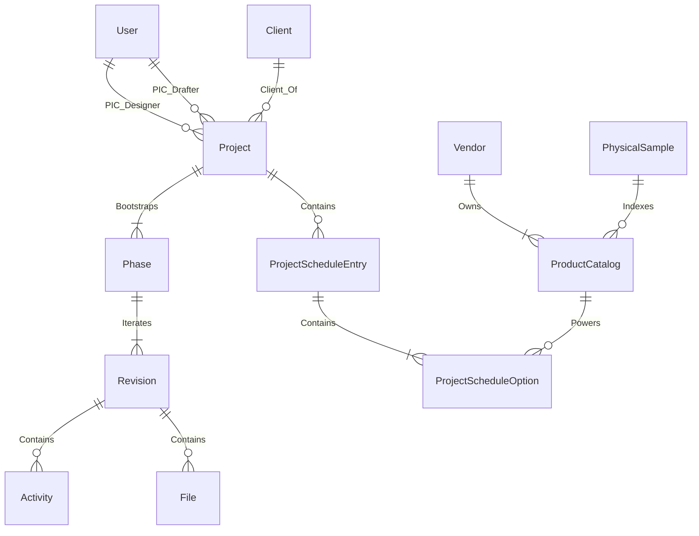

# StudioFlow (radsaas-2) - Master Single Source of Truth (SSOT)

> **Document Version:** 3.7.5 (WhatsApp-style Hashtag Autocomplete & Locked Phase Protection)
> **Last Updated:** June 17, 2026
> **Purpose:** Canonical documentation of the StudioFlow system codebase, architecture, database schemas, business workflows, and security matrices. This document serves as a roadmap for system audits and developers.

---

## 1. COMPARISON MATRIX: OLD VS. REVERSE-ENGINEERED SSOT

| Domain / Concept | Old SSOT (v2.7.0) | Reverse-Engineered SSOT (v3.0.0) | Improvements & Solidification |
| :--- | :--- | :--- | :--- |
| **Authentication & Route Protection** | Vaguely assumed NextAuth protected all dashboard sub-paths. | Identified missing protection for `/activity` and `/activity-center` pages in `auth.config.ts`. | **Major Security Leak Found & Documented:** Exposes how unauthenticated users bypass middleware checks. |
| **Option Deletion & Selection** | Stated that deleting a "Final" option automatically promotes a sibling. | Uncovered that `smartDeleteOption` does **not** update `ProjectScheduleEntry.active_index`, resulting in front-end indices pointing out of bounds. | **UI Crash Risk Disclosed:** Explains why array offset errors occurred and defines parent index sync requirements. |
| **Manual Duplication Check** | Claimed composite sku/brand checks prevented all duplicate items. | Revealed that if both `catalog_sku` and `catalog_color` are left blank, duplicate checks are bypassed. | **Logic Loophole Covered:** Restricts empty identifier combinations for the same brand. |
| **Audit Log Query Bounds** | Simply stated logs are queried by date range. | Identified timezone offsets query bugs (`T00:00:00.000Z` vs local `GMT+07:00`). | **Corrected Date Logic:** Prevents missing logs created during early morning local hours. |
| **Re-indexing Normalization** | Abstractly defined "re-indexing". | Described the exact two-phase negative-increment mechanism used to bypass database composite unique constraints. | **Technical Clarity for Juniors:** Details why negative numbers (e.g. `-1`, `-2`) are used during transaction updates. |
| **CD List Drawing Codes** | Required CD codes to be `ID_[Number]`. | Revealed that entering `CD-01` or `CD.1` breaks regex validation and throws `INVALID_INPUT`. | **Validated Input Scope:** Extends allowed format scope beyond hardwired regex limits. |
| **Aesthetic Constraints** | Declared "Zero Hardcode Policy". | Evaluated files (e.g., `GradualInputForm.tsx`) and logged hardcoded styling violations (`rounded-lg`, `shadow-xl`, etc.). | **UI Refactoring Log:** Identifies exact files and lines violating the visual identity system. |

---

## 2. PRODUCT IDENTITY & AESTHETIC ENGINE

StudioFlow follows a premium minimalist identity. Typography, interactions, and data hierarchies are governed strictly to maintain clean visual layouts.

### 2.1 Visual Standards
-   **Typography Stack**: 
    -   **Headings / Project Titles**: Lora (`font-serif`), serif, bold, tracking-tight.
    -   **Functional UI / Forms**: Inter (`font-sans`), sans-serif, normal/medium weight.
    -   **Metadata labels**: Inter, bold, size `[10px]`, tracking uppercase.
-   **Color Palette**: Canvas background is Slate Neutrals (`slate-50` / `#f8fafc`). Cards are solid white. Borders are Slate-200 (`border-subtle`). Accents use slate-900 (primary actions) or amber/red for status warnings.
-   **Animations & Micro-interactions**: Micro-animations are limited to subtle opacity/background transitions (e.g. `duration-500` or `duration-700` fade-ins). High-end minimalism prohibits bouncy or complex decorative layouts.

### 2.2 View-First Protocol & Interaction Gatekeepers
1.  **Read-Only Default State**: Any modal or form editing existing data (e.g. `LibraryFormModal`, `ScheduleWorkspaceInspector`) MUST launch in a read-only view.
2.  **Modify Gatekeeper**: A distinct "Modify" toggle button (Edit icon) must be explicitly clicked to transition fields into editable form controls.
3.  **Scheduler Exemption**: Project Schedule entries are exempt from this protocol. Because their changes are localized to a specific project scope and do not overwrite global library items, they open directly in edit mode.
4.  **3-Tier Information Hierarchy**:
    -   *Tier 1 (Primary)*: Core product identifiers: `catalog_sku` and `catalog_product_name`.
    -   *Tier 2 (Secondary)*: Initials and physical properties: `catalog_color`, `catalog_pattern`, and `catalog_finishing`.
    -   *Tier 3 (Tertiary)*: Dimensions, tagging metadata, and notes.
5.  **Auto-Fallback Rule (Canonical Law)**: If Tier 1 properties (`catalog_sku`, `catalog_product_name`) are missing or empty, the rendering layer MUST automatically promote Tier 2 properties (`catalog_color`, `catalog_pattern`, `catalog_finishing`) to the primary title lines with identical typographic weight (`font-serif`, Lora). Blank placeholders or empty hyphens (`-`) are layout violations.

---

## 3. FOUR-LAYER CODEBASE ARCHITECTURE

The project separates logic into four distinct layers. Cross-layer calls are strictly managed via public interfaces.



1.  **core/platform**: Wires DB pools, instantiates the Prisma Client with adapters, verifies database schema integrity on boot (Preflight verification), and logs raw audit history.
2.  **core/rbac**: Maps permissions to actions. It provides assertion hooks (`assertPermission`) and evaluates contextual authorization (such as verifying if a designer is the assigned Lead Designer on the current project).
3.  **core/domain-shared**: Houses shared business rules like sequence generators, date timeline calculators, and auto-naming format algorithms.
4.  **extensions/**: Semi-autonomous modules containing their own server actions, service classes, UI forms, and components.
    -   *Extension Facades*: Wires communication between modules (e.g. `LibraryService.getSuggestions` supplying data to the `ScheduleSearchBar` in the scheduler). Direct internal imports between different extensions are forbidden.

---

## 4. DATABASE SCHEMA & PERSISTENCE ENTITIES

The schema is built on PostgreSQL. Wires are established using Prisma ORM with custom types mapped as follows:



### 4.1 Core Workflows & Schema Models

#### `User`
Tracks credentials and permissions. Wires relations to projects (as PIC Designer or PIC Drafter), task assignments, and audit logs.
-   `role`: Enum `[ADMIN, DIC, DRIC, STAFF]`.

#### `Client`
Owns projects. Identifies client contacts, branding assets, and addresses.
-   `name`: Unique string.

#### `Project`
Stores project configurations, codes, and lifecycle flags.
-   `project_code`: Unique identifier matching naming conventions.
-   `name`: Formatted project name.
-   `status_progress`: Enum `[ACTIVE, COMPLETED, ON_HOLD]`.
-   `pic_designer_id` (Lead Designer / DIC) and `pic_drafter_id` (Lead Drafter / DRIC).

#### `Phase`
Stages through which a project progresses: `MOODBOARD`, `LAYOUT`, `DESIGN_3D`, `CD` (Construction Drawings), `SUPERVISION`.
-   `status_enum`: Enum `[PENDING, IN_PROGRESS, ON_REVIEW_INTERNAL, APPROVED_INTERNAL, ON_REVIEW_CLIENT, READY_FOR_NEXT, COMPLETED]`.
-   `is_locked`: Prevents further modification once a phase is client-approved.
-   `allow_parallel`: Allows parallel progression of layouts, 3D designs, and construction drawings.

#### `Revision` & `Activity`
Revisions track design iterations. Activities hold todo items and external feedback.
-   `major` / `minor`: Track revisions (e.g., v1.0).
-   `mode`: `TODO` (internal tasks) or `FEEDBACK` (tasks requested by client).
-   `status`: `OPEN` or `COMPLETED`.

#### `CDList`
Used in the Construction Drawings (`CD`) phase to index, group, and track technical drawings.
-   `group_code`: Formatted group code (e.g. `ID_1.2`).
-   `status_enum`: `[PENDING, IN_PROGRESS, COMPLETED]`.

#### `AuditLog`
Tracks system mutations.
-   `action`: String identifier (e.g., `SCHEDULE_CREATE_ENTRY`).
-   `project_id` & `phase_id`: Optional bindings.
-   `details`: JSON snapshot capturing fields before and after changes.
-   *Data Retention Policy*: Audit logs are preserved indefinitely. Deleting a project sets project references in logs to `NULL`, maintaining historical trails.
### 4.2 Global Activity Workflow (v3.7.5)
- **Agile Creation:** Tasks (Activities) can be added to a project at any time, with or without a phase/revision tag. Unbound tasks are treated as project-level tasks.
- **WhatsApp-style Hashtag Autocomplete (v3.7.5):** Todo inputs in Today's View support a WhatsApp-style floating autocomplete dropdown when typing `#`. It filters and lists all project phases (including locked/completed ones, clearly marked with a `(Locked)` badge). Keyboard navigation (`ArrowUp`/`ArrowDown`) automatically skips locked options. Selecting an option via click or `Enter` applies the phase tag, closes the dropdown, and cleans the `#tag` text from the input.
- **Locked Phase Protection (v3.7.5):** Strict validation is enforced in both `TodayInlineAdd` and `TodayQuickAddModal` to prevent task insertion under locked or inactive phases, throwing a clear error message (e.g., `Phase "CD" is locked. You cannot add tasks to it.`) instead of silent plain-text fallback.
- **Project Overview Integration:** Unbound project-level tasks are rendered in a dedicated client-side card in the Project Overview.
- **Contextual Blocker:** Phase submission for review is blocked only by `OPEN` tasks tagged to that specific phase or its active revision.
- **Today's View Integration:** Aggregates all `OPEN` tasks assigned to the user across all active projects, with unbound project-level tasks presented under a virtual "General Tasks" phase.

---

## 5. PILLAR 2: LIBRARY & SCHEDULER DEEP DIVE

The Scheduler spreadsheet is a "Smart Sheet" displaying specifications. The Library acts as a global material inventory.

### 5.1 Snapshot-First Architecture
To insulate active projects from retroactive library updates (price changes, brand updates, deleted materials), the scheduler saves design selections as frozen JSON snapshots:
-   **JSON Snapshot Model (`data_snapshot`)**: Contains a duplicate schema copy of the catalog item's SKU, brand, initials, motif, dimensions, and colors at the exact moment of insertion.
-   **Custom Mutations**: Designers can edit snapshot parameters locally (e.g. specifying a custom paint color for a project option) without polluting the global library catalog.

### 5.2 Unique Code Generation & Re-indexing
Scheduler codes follow the format `[Prefix]-[Increment]` (e.g. `PT-01`). To maintain sequential index order without database conflicts:
1.  **Unique Composite Key**: Enforced in PostgreSQL via `@@unique([project_id, section, schedule_prefix, schedule_increment])`.
2.  **Two-Phase Re-indexing (Normalization)**: When rows are deleted, reordered, or added:
    -   *Phase 1*: The database temporarily updates all entries in the category to **negative numbers** (`schedule_increment = -1, -2, -3`). This frees up positive numbers and prevents composite key collisions.
    -   *Phase 2*: Updates increments sequentially using positive numbers starting from `1` based on the requested sort order (`schedule_sort_order`).

### 5.3 Option Deletion (Smart Selection Promotion)
A schedule row (entry) can have multiple candidate options (A, B, C...).
-   Only one option can be marked `is_final = true` (Approved).
-   **Sibling Promotion**: If the `is_final` option is deleted, the system automatically sorts the remaining options by alphabetical order, marks the first sibling as `is_final = true`, and sets its status to `APPROVED`. This prevents empty specification states.

### 5.4 Explicit Library Promotion
Materials can be added as local manual drafts in a project scheduler. To promote drafts to the global library:
1.  **Stage 1 Gate (Draft Snapshot)**: Requires classification data (`catalog_color`, `catalog_pattern`, or `catalog_finishing`) and vendor. Wires local draft snapshot.
2.  **Stage 2 Gate (Global Promotion)**: Requires full identity data: `catalog_sku`, `catalog_product_name`, `catalog_brand`, and `catalog_image_url`. The promotion request enters the review queue.
3.  **Auto-Approve Exception**: If an `ADMIN` initiates a promotion request, the system bypasses the queue and automatically approves and creates the catalog item immediately.

### 5.5 Product Request Lifecycles
Used by designers to request sample acquisitions from the catalog team:
-   **Simplified Lifecycle**: `REQUESTED` $\rightarrow$ `IN_PROGRESS` $\rightarrow$ `RECEIVED` / `UNAVAILABLE`.
-   **Context Badges**: UI displays the project code badge (e.g. `PT-01`) if linked to an active scheduler row.
-   **Retention Policies**: Terminal requests (`RECEIVED`, `UNAVAILABLE`) are automatically filtered out of the active view. A toggle history view displays them for up to 7 days before archiving.

### 5.6 SketchUp Integration & Manual Material Linking
To connect SketchUp 3D models with project schedule documents without risking the dynamic string-coupling (re-indexing code changes like `PT-01` shifting rows):
1.  **Materials Linking (Manual / Explicit)**: A `SketchupMaterial` is mapped to a `ProjectScheduleEntry` via a dedicated, nullable foreign key: `linked_entry_id`.
    -   *No Auto-Linking by Code*: Materials are manually mapped from the web UI to avoid re-ordering desyncs.
    -   *On Delete Cascade/SetNull*: If the linked schedule entry is deleted, the link is set to `NULL` (`onDelete: SetNull`).
2.  **FF&E Linking (Auto-link by Code)**: An FF&E entry is matched to a `ProjectScheduleEntry` dynamically by code string (e.g. `SF-01` in SketchUp matching `SF-01` in the project schedule).
    -   *No Database FK*: FF&E does not store `linked_entry_id` because FF&E codes are stable and driven primarily by the 3D model.
3.  **Metadata Protection**: To prevent the plugin from overwriting manual web edits (such as custom finishes, brand inputs, or images), the sync API endpoint (`/api/sketchup/sync`) ignores web-managed fields on upsert, only updating technical properties (`code`, `uuid`, `area`, `face_count`, `backface_count`).

---

## 6. ROLE-BASED ACCESS CONTROL (RBAC)

System authorization is governed by role permissions and verified by contextual ownership.

### 6.1 Static Role Permissions Matrix

| Permission | ADMIN | DIC (Lead Designer) | DRIC (Drafter) | STAFF (General) |
| :--- | :---: | :---: | :---: | :---: |
| **PROJECT_CREATE** / **PROJECT_DELETE** | ✅ | ❌ | ❌ | ❌ |
| **PROJECT_EDIT_METADATA** | ✅ | ⚠️ (DIC Only) | ❌ | ❌ |
| **PROJECT_VIEW_AUDIT** | ✅ | ✅ | ❌ | ✅ |
| **PHASE_ACTIVATE** / **PHASE_SUBMIT_REVIEW** | ✅ | ⚠️ (DIC Only) | ⚠️ (CD Phase Only) | ❌ |
| **PHASE_MUTATE_CONTENT** | ✅ | ⚠️ (DIC Only) | ⚠️ (CD Phase Only) | ❌ |
| **PHASE_MANAGE_CD** | ✅ | ✅ | ✅ | ❌ |
| **PLUGIN_SCHEDULE_ADD** / **EDIT** / **DELETE** | ✅ | ✅ | ✅ | ❌ |
| **SKETCHUP_INTEGRATION_MANAGE** | ✅ | ❌ | ❌ | ❌ |
| **LIBRARY_VIEW** | ✅ | ✅ | ✅ | ✅ |
| **LIBRARY_CREATE_ITEM** / **EDIT** / **DELETE** | ✅ | ❌ | ❌ | ❌ |
| **LIBRARY_REQUEST_MATERIAL** | ✅ | ✅ | ✅ | ❌ |
| **LIBRARY_PROCESS_REQUEST** | ✅ | ❌ | ❌ | ❌ |
| **SYSTEM_CONFIG_EDIT** | ✅ | ❌ | ❌ | ❌ |

-   **⚠️ DIC/DRIC Context Checks**: When a DIC or DRIC attempts a mutation, guards verify `userId === project.pic_designer_id` (for DIC) or `userId === project.pic_drafter_id` (for DRIC).
-   **STAFF Guard**: staff roles can edit catalog items only if their status is `PENDING`. They cannot edit or override `APPROVED` global entries.

---

## 7. SYSTEM RESILIENCE: REVERSIONS & UNDO MECHANISMS

StudioFlow implements a transaction-safe reversion engine allowing Admins and Lead Designers to revert phase transitions from the Audit log.

### 7.1 Reversible Action Triggers

| Audit Action | Reversion Logic / Database Operations |
| :--- | :--- |
| **`ACTIVATE_PHASE`** | Reverts Phase status to `PENDING` / `is_locked: false`. Deletes the initialized `Revision` (v1.0) and associated activities. |
| **`SUBMIT_FOR_INTERNAL_REVIEW`** | Reverts Phase status to `IN_PROGRESS` / `is_locked: false`. |
| **`APPROVE_INTERNAL`** | Reverts Phase status back to `ON_REVIEW_INTERNAL`. |
| **`SUBMIT_FOR_CLIENT_REVIEW`** | Reverts Phase status back to the previous review state (`ON_REVIEW_INTERNAL` / `APPROVED_INTERNAL`). |
| **`APPROVE_CLIENT_PHASE`** | Reverts Phase status to `ON_REVIEW_CLIENT` / `is_locked: false`. Restores Project status to `ACTIVE` (if it was marked completed). Reopens the closed active revision. |
| **`REJECT_PHASE_INTERNAL` / `CLIENT`**| Reverts Phase status to the corresponding review state. Marks the newly generated active revision as `COMPLETED`, and reopens the previously active revision. |
| **`REOPEN_PHASE`** | Restores Phase status to `READY_FOR_NEXT` / `is_locked: true`. Wipes all activities and files created during the reopened revision, deletes it, and reopens the previous revision. |
| **`COMPLETE_SUPERVISION_PHASE`** | Reverts Supervision Phase status to `IN_PROGRESS` / `is_locked: false`. Restores Project status to `ACTIVE`. Reopens the closed supervision revision. |
| **`PROJECT_COMPLETED_MANUAL`** | Reverts Project status back to its previous state (`ACTIVE` / `ON_HOLD`). |
| **`REVISION_OVERRIDE_ADMIN`** | Reverts Phase status to `IN_PROGRESS`. Deletes all activities and files under the override revision, deletes the revision, and re-establishes the previous revision as `ACTIVE`. |
| **`BYPASS_PHASE_TO_COMPLETED`** | Reverts Phase status to `PENDING` / `is_locked: false`. Restores Project status to `ACTIVE`. Deletes the bypassed revision. |

---

## 8. KNOWN DEFECTS & SECURITY AUDIT LOG

This section compiles the active vulnerabilities and code anomalies identified in the codebase, along with their associated risks and mitigation strategies.

### 🚨 Issue 1: Public Authentication Bypass on `/activity` (Global Activity Center)
-   **Vulnerability Type**: Access Control / Authentication Bypass.
-   **Location**: [src/auth.config.ts](file:///d:/Projects/studioflow/src/auth.config.ts#L24-L43) and [src/app/(dashboard)/activity/page.tsx](file:///d:/Projects/studioflow/src/app/(dashboard)/activity/page.tsx#L18).
-   **Reasoning**: `/activity` and `/activity-center` are omitted from NextAuth's `isDashboardRoute` list. Consequently, the middleware does not enforce authentication. The Activity Page calls `getSession()` which defaults unauthenticated requests to `role: STAFF` and `userId: ""`, bypassing authentication checks and exposing all office activity records.
-   **Mitigation**: Add `/activity` and `/activity-center` paths to `isDashboardRoute` in [src/auth.config.ts](file:///d:/Projects/studioflow/src/auth.config.ts):
    ```typescript
    const isDashboardRoute =
      nextUrl.pathname === "/" ||
-   **Mitigation (Implemented)**: Added `/activity` and `/activity-center` paths to `isDashboardRoute` in [src/auth.config.ts](file:///d:/Projects/studioflow/src/auth.config.ts), enforcing secure session validation via NextAuth middleware.

### 💥 Issue 2: Parent `active_index` Desync on Sibling Option Deletion (RESOLVED)
-   **Vulnerability Type**: Data Consistency / Runtime Application Crash.
-   **Location**: [src/extensions/schedule/services/schedule-service.ts](file:///d:/Projects/studioflow/src/extensions/schedule/services/schedule-service.ts#L728-L767).
-   **Reasoning**: When an active option is deleted, the system promotes a sibling to `is_final = true`. However, the parent `ProjectScheduleEntry.active_index` remains unchanged. If the option array shrinks, this index may point to a non-existent element or select the wrong option.
-   **Mitigation (Implemented)**: Modified `smartDeleteOption` in `schedule-service.ts` to query remaining siblings, find the index of the newly promoted option in the database-sorted options array (`orderBy: { option_label: "asc" }`), and update the parent entry's `active_index` within the database transaction.

### 🕰️ Issue 3: Timezone Offset Gaps in Audit date filtering (RESOLVED)
-   **Vulnerability Type**: Logical Filter Bypass / Reporting Inaccuracy.
-   **Location**: [src/core/platform/audit/query-builder.ts](file:///d:/Projects/studioflow/src/core/platform/audit/query-builder.ts#L5-L14).
-   **Reasoning**: Wires date bounds to hardcoded UTC string formatting (`T00:00:00.000Z` and `T23:59:59.999Z`). In timezones like `GMT+07:00`, early morning logs are misclassified or ignored in range queries.
-   **Mitigation (Implemented)**: Adjusted date query formatting to apply client local timezone offset (+07:00 WIB) boundary parsing (`toWIBBoundary`), ensuring early morning logs are correctly included.

### 👥 Issue 4: Empty SKU and Color Bypasses Duplication Checks in manual scheduler entries (RESOLVED)
-   **Vulnerability Type**: Data Integrity / Duplicate Insertion.
-   **Location**: [src/extensions/schedule/services/schedule-service.ts](file:///d:/Projects/studioflow/src/extensions/schedule/services/schedule-service.ts#L221-L254).
-   **Reasoning**: If a user creates a manual option leaving both SKU and Color empty, `effectiveSku` becomes undefined, bypassing duplicate validations.
-   **Mitigation (Implemented)**: Enforced that at least one identifying property (SKU or Color) is mandatory, throwing an explicit `ActionError` if both are empty.

### 📁 Issue 5: CD Code Prefix Validation Failure
-   **Vulnerability Type**: Input Validation Restriction.
-   **Location**: [src/actions/_shared.ts](file:///d:/Projects/studioflow/src/actions/_shared.ts#L149-L161).
-   **Reasoning**: `normalizeDrawingCode` strips only `ARS` and `ID` prefixes. Drawing codes starting with `CD-01` are rejected by validation regex checks.
-   **Mitigation**: Extend prefix stripping in `normalizeDrawingCode` to support CD prefixes:
    ```typescript
    const trimmed = input
      .trim()
      .toUpperCase()
      .replace(/^ARS[_\-\s]*/i, "")
      .replace(/^ID[_\-\s]*/i, "")
      .replace(/^CD[_\-\s]*/i, ""); // Strip CD phase prefix
    ```

### 🗑️ Issue 6: Dead Code - `switchActiveOption`
-   **Vulnerability Type**: Unused Logic / Bundle Overhead.
-   **Location**: [src/extensions/schedule/services/schedule-service.ts](file:///d:/Projects/studioflow/src/extensions/schedule/services/schedule-service.ts#L1036-L1060).
-   **Reasoning**: `switchActiveOption` is defined but never called by any router, page, or action wrapper.
-   **Mitigation**: Remove the function or hook it to an active front-end control if index switching is required.

### 🎨 Issue 7: Design Token Hardcoding in `GradualInputForm.tsx` (RESOLVED)
-   **Vulnerability Type**: Style Guidelines Violation.
-   **Location**: [src/extensions/schedule/components/GradualInputForm.tsx](file:///d:/Projects/studioflow/src/extensions/schedule/components/GradualInputForm.tsx).
-   **Reasoning**: Hardcoded Tailwind parameters (`rounded-full`, `rounded-lg`, `shadow-xl`, `text-2xl`, etc.) violate the "Zero Hardcode Policy."
-   **Mitigation (Implemented)**: Replaced hardcoded style strings (`rounded-lg`, `shadow-xl shadow-slate-200`, `text-[10px] uppercase tracking-widest`) with design system tokens and variables in compliance with the Zero Hardcode policy.


---

## 9. SKETCHUP INTEGRATION & PRODUCT SCHEDULE BRIDGE

The SketchUp plugin operates via staged bridging tables (`SketchupProject`, `SketchupMaterial`, `SketchupFFE`, `SketchupMergeAction`). Design specifications are brought into the main Product Schedule via explicit Push operations.

### 9.1 Data Push Rules
1. **FF&E Components**: Automatically synchronized and linked by parsing their code prefixes (e.g., `SF-01` -> prefix `SF`, increment `1`). This creates or updates `ProjectScheduleEntry` records of type `fixture`, injecting the `instance_count` from SketchUp into `schedule_qty`.
2. **Materials**: Pushed strictly via manual interaction:
   - **Linked Materials**: Translates the staged metadata into option snapshots under the linked `ProjectScheduleEntry`.
   - **Push as New Entry**: Creates a new sequential schedule entry under a resolved category based on prefix lookup, then links the material.
3. **Initials vs Primary Option Promotion**:
   - **Case A (Incomplete Metadata)**: Created as `is_final: true` options with `status: DRAFT`. The code is mapped to the `catalog_color` snapshot property as a placeholder, with `catalog_brand: "Custom"`.
   - **Case B (Complete Metadata)**: Created as `is_final: true` options with `status: APPROVED`. Syncs brand and type/finish into the snapshot.

