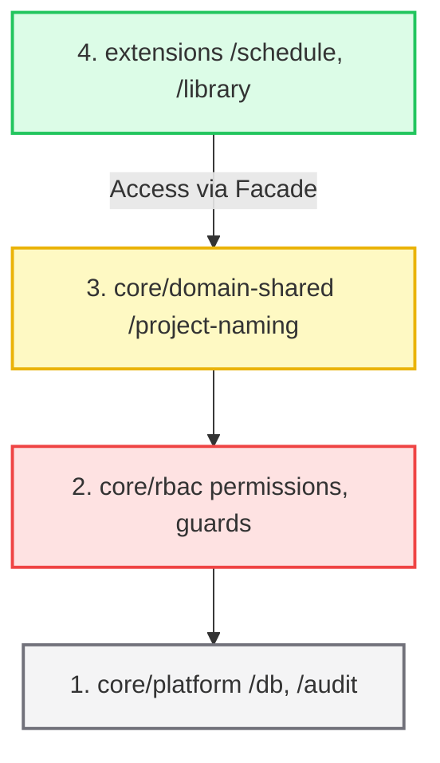
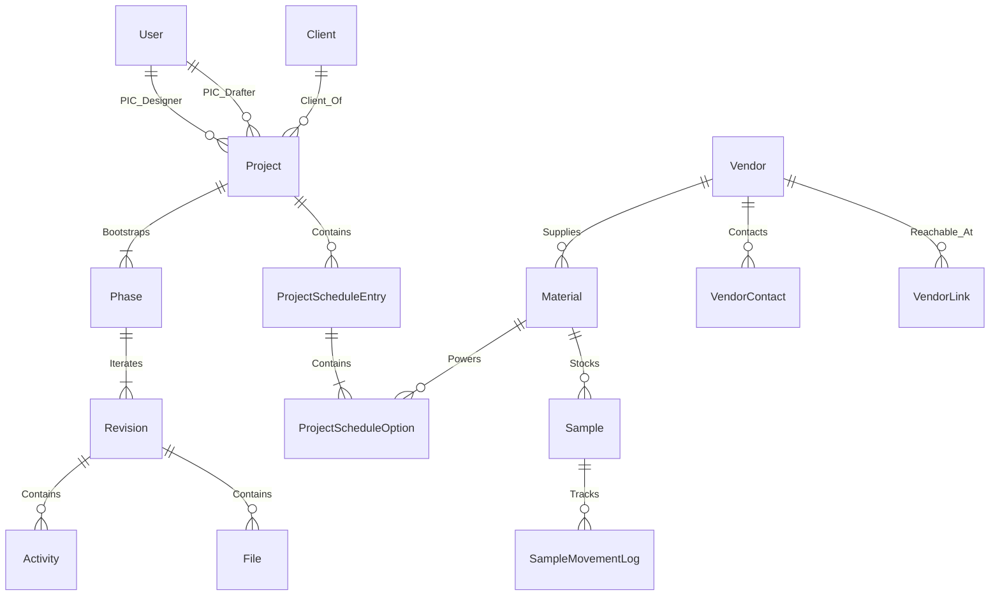

# StudioFlow (radsaas-2) - Master Single Source of Truth (SSOT)

> **Document Version:** 3.10.1 (Phase waiting-time persistence)
> **Last Updated:** August 3, 2026
> **Purpose:** Canonical documentation of the StudioFlow system codebase, architecture, database schemas, business workflows, and security matrices. This document serves as a roadmap for system audits and developers.

---

## 1. COMPARISON MATRIX: OLD VS. REVERSE-ENGINEERED SSOT

| Domain / Concept | Old SSOT (v2.7.0) | Reverse-Engineered SSOT (v3.0.0) | Improvements & Solidification |
| :--- | :--- | :--- | :--- |
| **Authentication & Route Protection** | Vaguely assumed NextAuth protected all dashboard sub-paths. | Identified missing protection for `/activity` and `/activity-center` pages in `auth.config.ts`. | **Major Security Leak Found & Documented:** Exposes how unauthenticated users bypass middleware checks. |
| **Option Deletion & Selection** | Stated that deleting a "Final" option automatically promotes a sibling. | Uncovered that `smartDeleteOption` does **not** update `ProjectScheduleEntry.active_index`, resulting in front-end indices pointing out of bounds. | **UI Crash Risk Disclosed:** Explains why array offset errors occurred and defines parent index sync requirements. |
| **Manual Duplication Check** | Claimed composite sku/brand checks prevented all duplicate items. | Revealed that if both `catalog_sku` and `catalog_color` are left blank, duplicate checks are bypassed. | **Logic Loophole Covered:** Restricts empty identifier combinations for the same brand. |
| **Audit Log Query Bounds** | Simply stated logs are queried by date range. | Identified timezone offsets query bugs (`T00:00:00.000Z` vs local `GMT+07:00`). | **Corrected Date Logic:** Prevents missing logs created during early morning local hours. |
| **Re-indexing Normalization** | Abstractly defined "re-indexing". | Described the exact two-phase negative-increment mechanism used to bypass database composite unique constraints. | **Technical Clarity for Juniors:** Details why negative numbers (e.g. `-1`, `-2`) are used during transaction updates. |
| **CD List Drawing Codes** | Required CD codes to be `ID_[Number]`. | Revealed that entering `CD-01` or `CD.1` breaks regex validation and throws `INVALID_INPUT`. | **Validated Input Scope:** Extends allowed format scope beyond hardwired regex limits. |
| **Aesthetic Constraints** | Declared "Zero Hardcode Policy". | Evaluated files (e.g., `GradualInputForm.tsx`) and logged hardcoded styling violations (`rounded-lg`, `shadow-xl`, etc.). | **UI Refactoring Log:** Identifies exact files and lines violating the visual identity system. |

---

## 2. PRODUCT IDENTITY & AESTHETIC ENGINE

StudioFlow follows a premium minimalist identity. Typography, interactions, and data hierarchies are governed strictly to maintain clean visual layouts.

### 2.1 Visual Standards
-   **Typography Stack**: 
    -   **Headings / Project Titles**: Lora (`font-serif`), serif, bold, tracking-tight.
    -   **Functional UI / Forms**: Inter (`font-sans`), sans-serif, normal/medium weight.
    -   **Metadata labels**: Inter, bold, size `[10px]`, tracking uppercase.
-   **Color Palette**: Canvas background is Slate Neutrals (`slate-50` / `#f8fafc`). Cards are solid white. Borders are Slate-200 (`border-subtle`). Accents use slate-900 (primary actions) or amber/red for status warnings.
-   **Animations & Micro-interactions**: Micro-animations are limited to subtle opacity/background transitions (e.g. `duration-500` or `duration-700` fade-ins). High-end minimalism prohibits bouncy or complex decorative layouts.

### 2.2 Edit-First Protocol & Exit Guard

> **REVOKED 2026-08-14 — View-First Protocol.** The previous rules 1–3 read:
> *"Read-Only Default State: any modal or form editing existing data MUST launch
> in a read-only view. Modify Gatekeeper: a distinct 'Modify' toggle button
> must be explicitly clicked to transition fields into editable form controls.
> Scheduler Exemption: Project Schedule entries are exempt."* Owner revoked all
> three: *"tidak perlu double gini, saat diklik lgsg aja ada inline edit"*. The
> Scheduler exemption is moot — every dialog now behaves the way Scheduler did.

1.  **Edit-Ready Default State**: Any modal or form editing existing data launches with its fields ready to type into. There is no "Modify" step.
2.  **Permission Is The Only Gate**: `editable` derives directly from access rights (`canManage`, `access.canEdit`), never from UI state. Read-only rendering is retained for users who lack the right — it stopped being the default, it was not deleted.
3.  **Exit Guard Is Mandatory**: Every editable dialog MUST wire `useUnsavedChangesGuard` and render `<UnsavedChangesPrompt>` (`src/hooks/use-unsaved-changes-guard.tsx`). Closing with pending edits asks for confirmation; closing an untouched form does not interrupt. This is what replaces the protection the Modify gate used to give — an edit-first dialog without it is an incomplete implementation, not a simpler one.
4.  **Close After Save Via The Guard**: Use `guard.closeAfterSave()`, not `onOpenChange(false)`. The form legitimately differs from its snapshot at that moment, and asking "discard changes?" immediately after saving them is the wrong question.
4.  **3-Tier Information Hierarchy**:
    -   *Tier 1 (Primary)*: Core product identifiers: `catalog_sku` and `catalog_product_name`.
    -   *Tier 2 (Secondary)*: Initials and physical properties: `catalog_color`, `catalog_pattern`, and `catalog_finishing`.
    -   *Tier 3 (Tertiary)*: Dimensions, tagging metadata, and notes.
5.  **Auto-Fallback Rule (Canonical Law)**: If Tier 1 properties (`catalog_sku`, `catalog_product_name`) are missing or empty, the rendering layer MUST automatically promote Tier 2 properties (`catalog_color`, `catalog_pattern`, `catalog_finishing`) to the primary title lines with identical typographic weight (`font-serif`, Lora). Blank placeholders or empty hyphens (`-`) are layout violations.

---

## 3. FOUR-LAYER CODEBASE ARCHITECTURE

The project separates logic into four distinct layers. Cross-layer calls are strictly managed via public interfaces.



1.  **core/platform**: Wires DB pools, instantiates the Prisma Client with adapters, verifies database schema integrity on boot (Preflight verification), and logs raw audit history.
2.  **core/rbac**: Maps permissions to actions. It provides assertion hooks (`assertPermission`) and evaluates contextual authorization (such as verifying if a designer is the assigned Lead Designer on the current project).
3.  **core/domain-shared**: Houses shared business rules like sequence generators, date timeline calculators, and auto-naming format algorithms.
4.  **extensions/**: Semi-autonomous modules containing their own server actions, service classes, UI forms, and components.
    -   *Extension Facades*: Wires communication between modules (e.g. `LibraryService.getSuggestions` supplying data to the `ScheduleSearchBar` in the scheduler). Direct internal imports between different extensions are forbidden.
    -   *Project MOM Extension*: A project-scoped documentation module for Minutes of Meeting / site inspection reports. It owns its own normalized persistence, editor UI, print view, and image annotation flow while staying anchored to the parent `Project`.

---

## 4. DATABASE SCHEMA & PERSISTENCE ENTITIES

The schema is built on PostgreSQL. Wires are established using Prisma ORM with custom types mapped as follows:



> **Corrected 30 Jul 2026.** The line above previously read
> `PhysicalSample ||--o{ ProductCatalog : Indexes`, i.e. the relation was drawn
> backwards. The foreign key is `PhysicalSample.product_id → ProductCatalog.id`,
> so **one ProductCatalog stocks many PhysicalSample**, not the reverse. Since
> migration `20260730210000_add_unlinked_physical_sample_intake`, that FK is
> nullable: an office-register sample may exist before a design-grade SKU is
> curated, while a linked sample still points to no more than one product. This
> matters for the workbook import: repeated `Sheet1` rows for the same
> Brand + Tipe + Motif mean several physical units of ONE catalog product, and
> the reversed diagram invited exactly the duplicated-ProductCatalog mistake
> that decision #14 forbids.

### 4.1 Core Workflows & Schema Models

#### `User`
Tracks credentials and permissions. Wires relations to projects (as PIC Designer or PIC Drafter), task assignments, and audit logs.
-   `role`: Enum `[ADMIN, OWNER, DIC, DRIC, STAFF, ESTIMATOR]`.
    -   `OWNER` was added 24 Jul 2026 (`20260724120000_add_owner_role`) but never recorded here — corrected 30 Jul 2026. Admin-level across the web app; the only difference from `ADMIN` is the SketchUp plugin surface, hard-gated to `role === "ADMIN"` at each call site.
    -   `ESTIMATOR` was added 30 Jul 2026 (`20260730160000_add_estimator_role`). BQ subapp only. See §6.2.
    -   This list is the documentation mirror of `enum Role` in `prisma/schema.prisma`. Both `ROLE_PERMISSIONS` (§6.1) and `APP_ACCESS` (§6.2) are typed `Record<Role, …>`, so widening the enum is a compile error until the role is explicitly handled in both.

#### `Client`
Owns projects. Identifies client contacts, branding assets, and addresses.
-   `name`: Unique string.

#### `Project`
Stores project configurations, codes, and lifecycle flags.
-   `project_code`: Unique identifier matching naming conventions.
-   `name`: Formatted project name.
-   `status_progress`: Enum `[ACTIVE, COMPLETED, ON_HOLD]`.
-   `pic_designer_id` (Lead Designer / DIC) and `pic_drafter_id` (Lead Drafter / DRIC).

#### `Phase`
Stages through which a project progresses: `MOODBOARD`, `LAYOUT`, `DESIGN_3D`, `CD` (Construction Drawings), `SUPERVISION`.
-   `status_enum`: Enum `[PENDING, IN_PROGRESS, ON_REVIEW_INTERNAL, APPROVED_INTERNAL, ON_REVIEW_CLIENT, READY_FOR_NEXT, COMPLETED]`.
-   `status_changed_at`: Nullable timestamp of the latest known status transition. It is updated atomically with every phase transition and undo. Existing phases are backfilled only where a surviving, non-reverted AuditLog transition provides evidence; `NULL` means unknown and must never be rendered as zero days.
-   `is_locked`: Prevents further modification once a phase is client-approved.
-   `allow_parallel`: Allows parallel progression of layouts, 3D designs, and construction drawings.

#### `Revision` & `Activity`
Revisions track design iterations. Activities hold todo items and external feedback.
-   `major` / `minor`: Track revisions (e.g., v1.0).
-   `mode`: `TODO` (internal tasks) or `FEEDBACK` (tasks requested by client).
-   `status`: `OPEN` or `COMPLETED`.

#### `CDList`
Used in the Construction Drawings (`CD`) phase to index, group, and track technical drawings.
-   `group_code`: Formatted group code (e.g. `ID_1.2`).
-   `status_enum`: `[PENDING, IN_PROGRESS, COMPLETED]`.

#### `AuditLog`
Tracks system mutations.
-   `action`: String identifier (e.g., `SCHEDULE_CREATE_ENTRY`).
-   `project_id` & `phase_id`: Optional bindings.
-   `details`: JSON snapshot capturing fields before and after changes.
-   *Data Retention Policy*: Audit logs are preserved indefinitely. Deleting a project sets project references in logs to `NULL`, maintaining historical trails.
### 4.2 Global Activity Workflow (v3.7.5)
- **Agile Creation:** Tasks (Activities) can be added to a project at any time, with or without a phase/revision tag. Unbound tasks are treated as project-level tasks.
- **WhatsApp-style Hashtag Autocomplete (v3.7.5):** Todo inputs in Today's View support a WhatsApp-style floating autocomplete dropdown when typing `#`. It filters and lists all project phases (including locked/completed ones, clearly marked with a `(Locked)` badge). Keyboard navigation (`ArrowUp`/`ArrowDown`) automatically skips locked options. Selecting an option via click or `Enter` applies the phase tag, closes the dropdown, and cleans the `#tag` text from the input.
- **Locked Phase Protection (v3.7.5):** Strict validation is enforced in both `TodayInlineAdd` and `TodayQuickAddModal` to prevent task insertion under locked or inactive phases, throwing a clear error message (e.g., `Phase "CD" is locked. You cannot add tasks to it.`) instead of silent plain-text fallback.
- **Project Overview Integration:** Unbound project-level tasks are rendered in a dedicated client-side card in the Project Overview.
- **Contextual Blocker:** Phase submission for review is blocked only by `OPEN` tasks tagged to that specific phase or its active revision.
- **Today's View Integration:** Aggregates all `OPEN` tasks assigned to the user across all active projects, with unbound project-level tasks presented under a virtual "General Tasks" phase.

### 4.3 Project MOM Workflow (v3.7.8)
- **Project-Scoped Parenting:** MOM records are stored at the `Project` level, not under `Revision`, `File`, or `Comment`. A single project can contain multiple MOM documents.
- **Header Identity Rule:** The visible project name inside MOM is always derived from `Project.name`. MOM documents store only report-specific fields such as `mom_topic`, `mom_date`, `mom_venue`, `mom_attendees`, and `mom_prepared_by_name`.
- **Normalized Storage:** MOM data is persisted through four dedicated models: `ProjectMomDocument`, `ProjectMomItem`, `ProjectMomPoint`, and `ProjectMomImage`.
- **Image Boundaries:** Each MOM item can store at most 2 images. Final edited assets are persisted through the shared media upload pipeline, while annotation is handled by the shared image markup modal.
- **Workflow Entry:** The primary workflow entry is the project extension route `/projects/[id]/mom`, with a shortcut exposed from the `SUPERVISION` phase UI. This shortcut is navigational only; it does not change MOM ownership semantics.

### 4.4 Deliverables Workflow (v3.7.9)
- **Single Active Deliverable Per Phase:** Deliverables are still persisted in the `File` model under a `Revision`, but the operational contract is one active deliverable per phase at a time.
- **Revision-Scoped Replacement Rule:** When a new deliverable is uploaded for a later revision in the same phase, the previously active deliverable is treated as temporary and is removed from persistence once the replacement is committed.
- **Temporary Semantics:** Unlike Project Discussion attachments, deliverables do not expire by time. Their temporary lifetime ends only when a newer revision deliverable replaces them.
- **Upload Surface:** Deliverables use the shared media upload pipeline and expose an attachment-style uploader UX consistent with Project Discussion, but with revision-aware replacement semantics rather than 30-minute temp retention.

---

## 5. PILLAR 2: LIBRARY & SCHEDULER DEEP DIVE

The Scheduler spreadsheet is a "Smart Sheet" displaying specifications. The Library acts as a global material inventory.

### 5.1 Snapshot-First Architecture
To insulate active projects from retroactive library updates (price changes, brand updates, deleted materials), the scheduler saves design selections as frozen JSON snapshots:
-   **JSON Snapshot Model (`data_snapshot`)**: Contains a duplicate schema copy of the catalog item's SKU, brand, initials, motif, dimensions, and colors at the exact moment of insertion.
-   **Custom Mutations**: Designers can edit snapshot parameters locally (e.g. specifying a custom paint color for a project option) without polluting the global library catalog.

### 5.2 Unique Code Generation & Re-indexing
Scheduler codes follow the format `[Prefix]-[Increment]` (e.g. `PT-01`). To maintain sequential index order without database conflicts:
1.  **Unique Composite Key**: Enforced in PostgreSQL via `@@unique([project_id, section, schedule_prefix, schedule_increment])`.
2.  **Two-Phase Re-indexing (Normalization)**: When rows are deleted, reordered, or added:
    -   *Phase 1*: The database temporarily updates all entries in the category to **negative numbers** (`schedule_increment = -1, -2, -3`). This frees up positive numbers and prevents composite key collisions.
    -   *Phase 2*: Updates increments sequentially using positive numbers starting from `1` based on the requested sort order (`schedule_sort_order`).

### 5.3 Option Deletion (Smart Selection Promotion)
A schedule row (entry) can have multiple candidate options (A, B, C...).
-   Only one option can be marked `is_final = true` (Approved).
-   **Sibling Promotion**: If the `is_final` option is deleted, the system automatically sorts the remaining options by alphabetical order, marks the first sibling as `is_final = true`, and sets its status to `APPROVED`. This prevents empty specification states.

### 5.4 Explicit Library Promotion
Materials can be added as local manual drafts in a project scheduler. To promote drafts to the global library:
1.  **Stage 1 Gate (Draft Snapshot)**: Requires classification data (`catalog_color`, `catalog_pattern`, or `catalog_finishing`) and vendor. Wires local draft snapshot.
2.  **Stage 2 Gate (Global Promotion)**: Requires full identity data: `catalog_sku`, `catalog_product_name`, `catalog_brand`, and `catalog_image_url`. The promotion request enters the review queue.
3.  **Auto-Approve Exception**: If an `ADMIN` initiates a promotion request, the system bypasses the queue and automatically approves and creates the catalog item immediately.

### 5.5 Product Request Lifecycles
Used by designers to request sample acquisitions from the catalog team:
-   **Simplified Lifecycle**: `REQUESTED` $\rightarrow$ `IN_PROGRESS` $\rightarrow$ `RECEIVED` / `UNAVAILABLE`.
-   **Context Badges**: UI displays the project code badge (e.g. `PT-01`) if linked to an active scheduler row.
-   **Retention Policies**: Terminal requests (`RECEIVED`, `UNAVAILABLE`) are automatically filtered out of the active view. A toggle history view displays them for up to 7 days before archiving.

### 5.6 SketchUp Integration & Catalog-to-Schedule Linking
To connect SketchUp 3D models with project schedule documents without risking dynamic code re-indexing:
1.  **Material Identity and Linking**: `SketchupMaterial.uuid` is the stable staged identity. A material maps to `ProjectScheduleEntry` through the nullable `linked_entry_id` foreign key; code remains a display and scheduler-classification value, not the relational key.
    -   *Edit-Driven Auto-Link*: The first StudioFlow Catalog Board edit creates and links a schedule entry when `linked_entry_id` is null. Existing explicit push controls remain for bulk work and conflict resolution.
    -   *On Delete SetNull*: Deleting the linked schedule entry resets the material link to `NULL` (`onDelete: SetNull`).
2.  **FF&E Code Resolution**: FF&E resolves a `ProjectScheduleEntry` by canonical prefix and increment (for example `SF-01`). The resolved entry id is also recorded in FF&E metadata for Catalog Board continuity, but there is no schema-level FF&E foreign key.
3.  **Metadata Protection**: The plugin sync endpoint updates only technical model properties on surviving staged rows. StudioFlow-managed catalog fields, images, notes, field-visibility overrides, and existing links are preserved; if an absent transient staging row is reconciled away, its linked schedule snapshot remains the durable project record.
4.  **Schedule-Only Operation**: Product Schedule entries with no staged SketchUp material remain valid Catalog Board sources. Manual material and fixture cards write directly to the final project snapshot and never auto-promote to the global Library.
5.  **Non-Destructive Plugin Absence**: A material missing from a plugin payload may remove only its transient `SketchupMaterial` staging row. It MUST NOT delete the linked `ProjectScheduleEntry` or its edited snapshot; the item remains available as a schedule-only Catalog Board card until explicitly deleted in StudioFlow.
6.  **API-Key Rotation**: Revoking SketchUp access rotates the credential on the existing `SketchupProject`. It MUST NOT delete the bridge record, staged items, schedule links, or project catalog data.
7.  **Verifiable Acknowledgement**: Sync responses include the exact material and fixture counts and codes read back from persisted staging rows, never request-echoed values. A received item that is not uniquely persisted or fails Product Catalog linking makes the response unsuccessful and returns item-level errors.
8.  **Coded Swatch Inclusion**: Every SketchUp material with a valid registered code is part of the plugin sync snapshot even when its current geometry usage is zero. The plugin keeps its `unused` status for local UI purposes, assigns a persistent UUID, and sends zero geometry counts rather than silently omitting it.
9.  **Reference URL Durability**: Catalog reference URLs persist in `SketchupMaterial.reference_url`, FF&E metadata, or the schedule snapshot according to source. Snapshot builders mirror the value into both `catalog_reference_url` locations so later edits and plugin syncs cannot blank it.
10. **Complete-Snapshot Attestation**: Staging prune is permitted only when the plugin explicitly sends `full_snapshot: true` after scanning every coded material and guaranteeing every UUID. Legacy, partial, ad-hoc, and empty payloads are additive-only.
11. **UUID Uniqueness**: Material UUIDs MUST be unique within one SketchUp model. Because SketchUp may clone attribute dictionaries when a swatch is duplicated, the plugin preserves the most-used material's UUID and assigns new UUIDs to duplicate copies before push. The API rejects malformed, duplicate-UUID, or duplicate-code payloads before any database mutation.
12. **Schedule-to-Staging Handoff**: When a schedule-only item later gains a SketchUp material or FF&E staging row, the existing schedule snapshot remains the catalog SSOT. Sync may hydrate only empty staging fields—including `catalog_fields`—from that snapshot and MUST NOT overwrite the snapshot. The first later Catalog Board edit merges against the existing snapshot so untouched values, notes, media, and metadata survive.

---

## 6. ROLE-BASED ACCESS CONTROL (RBAC)

System authorization is governed by role permissions and verified by contextual ownership.

### 6.1 Static Role Permissions Matrix

| Permission | ADMIN | DIC (Lead Designer) | DRIC (Drafter) | STAFF (General) |
| :--- | :---: | :---: | :---: | :---: |
| **PROJECT_CREATE** / **PROJECT_DELETE** | ✅ | ❌ | ❌ | ❌ |
| **PROJECT_EDIT_METADATA** | ✅ | ⚠️ (DIC Only) | ❌ | ❌ |
| **PROJECT_VIEW_AUDIT** | ✅ | ✅ | ❌ | ✅ |
| **PHASE_ACTIVATE** / **PHASE_SUBMIT_REVIEW** | ✅ | ⚠️ (DIC Only) | ⚠️ (CD Phase Only) | ❌ |
| **PHASE_MUTATE_CONTENT** | ✅ | ⚠️ (DIC Only) | ⚠️ (CD Phase Only) | ❌ |
| **PHASE_MANAGE_CD** | ✅ | ✅ | ✅ | ❌ |
| **PLUGIN_SCHEDULE_ADD** / **EDIT** / **DELETE** | ✅ | ✅ | ✅ | ❌ |
| **SKETCHUP_INTEGRATION_MANAGE** | ✅ | ❌ | ❌ | ❌ |
| **LIBRARY_VIEW** | ✅ | ✅ | ✅ | ✅ |
| **LIBRARY_CREATE_ITEM** / **EDIT** / **DELETE** | ✅ | ❌ | ❌ | ✅ |
| **LIBRARY_REQUEST_MATERIAL** | ✅ | ✅ | ✅ | ❌ |
| **LIBRARY_PROCESS_REQUEST** | ✅ | ❌ | ❌ | ✅ |
| **MASTERDATA_VIEW** / **VENDOR** / **OFFERING** / **SKU** | ✅ | ❌ | ❌ | ✅ |
| **MASTERDATA_PRICE_VIEW** / **PRICE_MANAGE** | ✅ | ❌ | ❌ | ✅ |
| **BQ_ACCESS** | ✅ | ❌ | ❌ | ❌ |
| **SYSTEM_CONFIG_EDIT** | ✅ | ❌ | ❌ | ❌ |

-   **⚠️ DIC/DRIC Context Checks**: When a DIC or DRIC attempts a mutation, guards verify `userId === project.pic_designer_id` (for DIC) or `userId === project.pic_drafter_id` (for DRIC).
-   **STAFF owns the Library.** In this office "admin" means the person who administers the material/supplier list, not a system administrator. The `PENDING → APPROVED` gate applies to designers promoting project drafts; it does not apply to the curator of the list. (This table previously stated the opposite; it was corrected to match the RBAC fix already recorded in `CHANGELOG.md` under *Library RBAC Inverted Against The Studio*.)
-   **OWNER** is omitted from the table: it is admin-level across the whole web app, identical to ADMIN except for the SketchUp plugin surface, which is hard-gated to `role === "ADMIN"` at each call site.
-   **ESTIMATOR** is omitted from the table because it holds exactly two permissions — `BQ_ACCESS` and `MASTERDATA_PRICE_VIEW` — and no project, phase or library authority at all. See §6.2.

### 6.2 App Access Matrix (Main App + Subapps)

StudioFlow is the main app and owns login and identity. Two subapps share that session. `src/core/rbac/app-access.ts` is the single source of truth; `scripts/verify-access-matrix.mjs` asserts the invariants below and must be run after any change to roles, permissions or routes.

| Role | StudioFlow `/` | Master Data `/masterdata` | BQ `/bq` | Lands on |
| :--- | :---: | :---: | :---: | :--- |
| ADMIN | ✅ | ✅ | ✅ | `/` |
| OWNER | ✅ | ✅ | ✅ | `/` |
| DIC | ✅ | ❌ | ❌ | `/` |
| DRIC | ✅ | ❌ | ❌ | `/` |
| STAFF | ⚠️ transition | ✅ | ❌ | `/masterdata` |
| ESTIMATOR | ❌ | ❌ | ✅ | `/bq` |

1.  **Fail-closed routing.** `resolveAppForPath` maps any unrecognised path to StudioFlow, so a new route is protected by default rather than silently public. The previous `authorized()` callback did the reverse: anything outside a hardcoded prefix list returned `true` even for unauthenticated requests.
2.  **Two-layer enforcement.** The edge proxy (`src/auth.config.ts`) gates entry; each subapp layout re-checks server-side. A change to the `src/proxy.ts` matcher regex therefore cannot expose subapp data on its own.
3.  **No landing-route loops.** A role's `LANDING_ROUTE` MUST be inside its own `APP_ACCESS`. Verified by invariant [3] in the verify script.
4.  **⚠️ STAFF transition.** `LEGACY_LIBRARY_ACCESS_FOR_STAFF` in `app-access.ts` keeps StudioFlow access for STAFF because their working surface is still `/extensions/library`. Removing it before `/masterdata` covers vendor/offering/SKU/sample management would be a functional regression, not a migration. Flip the flag to `false` and reduce STAFF's `APP_ACCESS` to `[MASTERDATA]` in the same commit.
5.  **Least-privilege fallback.** A session with a missing or unrecognised `role` claim resolves to `LEAST_PRIVILEGE_ROLE` (`DRIC`), never to `STAFF`. The former `?? "STAFF"` default in `src/auth.ts`, `src/lib/auth.ts` and the dashboard layout became a privilege-escalation path the moment STAFF gained write access to vendors, SKUs and pricing.
6.  **Designers are viewers.** DIC/DRIC hold `LIBRARY_VIEW` + `LIBRARY_REQUEST_MATERIAL` and no `MASTERDATA_*` or `BQ_*` permission. Promotion to Library requires STAFF or admin approval. Enforced by invariant [4].
7.  **Estimator isolation.** ESTIMATOR may enter `/bq` only. It holds `MASTERDATA_PRICE_VIEW` as a data-level read (BQ is the price consumer) but deliberately not `MASTERDATA_VIEW`, which gates the Master Data admin screens. Enforced by invariant [5].

8.  **⚠️ KNOWN GAP — `MASTERDATA_*` is not yet the enforcing authority.** The seven `MASTERDATA_*` permissions exist and are granted, but every vendor, SKU and promotion write still gates on the older `LIBRARY_*` permissions inside `src/extensions/library/actions/library-actions.ts` (`assertLibraryPermission`, ~20 call sites). Today the two agree, because STAFF holds both sets — so behaviour is correct. Architecturally it is not: Master Data authorization is currently *coincidental*.

    **The trap:** removing STAFF's `LIBRARY_*` grants on the assumption that `MASTERDATA_*` now governs Master Data would break every vendor and SKU write at once, with a bare `Unauthorized` and no clue why. Do not treat `MASTERDATA_*` as load-bearing until the action layer is migrated.

    Migrating it is a deliberate follow-up: `library-actions.ts` is shared by the Library UI, the schedule bridge and SketchUp, so the gates cannot simply be swapped. Sequence: split the master-data-owned actions out of `library-actions.ts`, gate the new copies on `MASTERDATA_*`, repoint `/masterdata` at them, then narrow STAFF's `LIBRARY_*` grants — in that order, each step verified. Only the new read-only actions in `src/subapps/master-data/actions/` gate on `MASTERDATA_*` today.

### 6.3 Master Data Ownership & The Pricing Override

**Decided 30 July 2026, superseding `UPSTREAM-BQ-MATERIAL-SOURCE.md` §0.1.** That document assigned material and vendor pricing exclusively to BQ and stated pricing would never appear in StudioFlow. That is now reversed:

-   **Master Data owns** supplier identity, SKU identity, vendor pricing and material pricing per SKU.
-   **BQ is a consumer** of pricing, not its owner. BQ retains estimation logic, markup and project breakdown.
-   Granular `BQ_*` permissions remain enforced inside BQ per §0.2. StudioFlow holds exactly one, `BQ_ACCESS`, to gate the `/bq` entry point. Do not add more.

**Known pre-existing leak, not introduced by this change.** `ProductCatalog.catalog_price` already exists in the StudioFlow schema and is already read by `schedule-service.ts` in six places, so pricing is in fact reachable by DIC/DRIC through project schedule snapshots today. This contradicted §0.1 before Master Data existed. It is deliberately left untouched here — removing a field that live snapshot code depends on is a separate, riskier change. Resolve it explicitly rather than by accident.

**Physical database topology was implemented 30 July 2026.** One PostgreSQL instance now has three schemas (`studioflow`, `master_data`, `bq`) through Prisma 7.5.0 multi-schema support. Migration `20260730183500_split_master_data_and_add_vendor_offering` uses `ALTER TABLE/TYPE … SET SCHEMA`, not Prisma's destructive drop/recreate output, so existing rows, indexes, foreign keys and cross-schema relations keep their identities. `_prisma_migrations` remains in `public`; `bq` exists but has no application table yet.

**Remaining isolation gap.** Runtime still connects through one database login, so schema placement is implemented but per-app PostgreSQL roles and `GRANT`s are not. Do not describe the current split as a security boundary until separate runtime roles/connections are wired and tested.

### 6.4 Schema Split — Model Placement, Naming, and the Legacy-Data Decision

**Decided and implemented 30 July 2026.** Extends §6.3's three-schema topology with where each existing and planned model lives, and how the 3 pre-existing `Vendor` rows and 4 `ProductCatalog` rows are treated.

**Model placement.** `Vendor`, `VendorContact`, `VendorOffering`, and future SKU-identity tables live in `master_data`. `ProductCatalog` and `PhysicalSample` **stay in `studioflow`** — they are design specification and physical inventory, not supplier or broad offering identity. `SampleMovementLog.sample_id` remains cascade-delete, which is why sample removal stays soft-delete. `PhysicalSample.product_id` is nullable and `onDelete: SetNull`, so a real inventory object survives before linkage or after a catalog record is removed. Keeping samples in `studioflow` also means the `List` importer — which only ever touches `master_data` plus `studioflow.AuditLog` — cannot reach them. `ProductCatalog` remains semantically mixed (`catalog_sku` is Master Data identity; `catalog_color`, `catalog_image_url`, `catalog_motif`, `catalog_finishing` are StudioFlow design fields); splitting it cleanly still requires a future nullable `master_sku_id` FK into a dedicated Master Data SKU table.

**Historical implementation note — superseded by §6.7.** `VendorOffering` was introduced as supplier capability rather than an SKU. The imported rows remain as source provenance, but the model is no longer the target user-facing domain.

**No table-name prefixing.** Schema is the namespace; `master_data.Vendor` is unambiguous without a `md_` or `_legacy` prefix on the table itself. Prisma expresses this as `@@schema("master_data")` on the model block, not as a renamed model. Field-level prefixing (`catalog_`, `schedule_`) continues per AGENTS.md Pillar 2 #5 — that convention exists for code and Zod clarity, not for schema separation, and is orthogonal to this decision.

**The 3 pre-existing `Vendor` rows are reused, not deleted or renamed.** The read-only database snapshot taken before the original Codex staging run found 3 active vendors and 4 active `ProductCatalog` rows (`MATERIAL_SUPPLIER_IMPORT_HANDOFF.md`). Two of those vendors — `EDL` and `NIRO GRANITE` — are independently confirmed present in the workbook (`List` row 119, `Jess Check` = green; `Sheet1` row 46 as `Niro granite`). A `_legacy` suffix or similar rename was considered and rejected:

-   It reintroduces the exact class of problem import decision #8 forbids — a migration-artifact string living in a real identity field, here `Vendor.brand_name` rather than `catalog_sku`.
-   `ProductCatalog.catalog_brand` is copied from `vendor.brand_name` at creation time and does not follow a later rename, so a renamed vendor and its existing products would permanently disagree on brand name.
-   It produces a permanent duplicate in the table whose entire purpose is to be the single source of truth (`EDL` and `EDL_legacy` both selectable forever in the brand dropdown).

Instead, the existing `LibraryService.resolveVendor` (case-insensitive match, revives if soft-deleted, reuses the id) already does the right thing unmodified. The importer's rule for `master_data.Vendor` is: match existing rows case-insensitively by `brand_name`; where a match exists, **fill only currently-null fields** from the workbook (website, IG, address) and never overwrite a populated field; where no match exists, insert. No `Vendor` row is deleted, renamed, or merged as part of this import. `Vendor` has no `onDelete: Cascade` relation, so there was never a referential reason to delete one.

**Alias resolution (import decision #5), verified 30 July 2026.** Three groups were flagged for possible merge. `List` has company data for only one of the three source brands (`Mozza`); the other names appear solely in `Sheet1`, which carries no company/website/contact columns at all — so verification for those two came from a live web search, not the workbook.

| Group | Verified as | Canonical | Rationale |
|---|---|---|---|
| `Mozza` / `Mozza tile` | Same company. `List` row 287: website `mozzatile.com`, IG `@mozzatile`, Jakarta. | `Mozza` | Company data exists directly in the source; `Mozza tile` is a product-line naming variant, not a separate supplier. |
| `Niro` / `Niro Granite` / `Niro granite` | PT Niro Ceramic Nasional Indonesia, part of Niro Ceramic Group (est. 1979), `nirogranite.co.id`. | matches the **existing** `master_data.Vendor` row `NIRO GRANITE` | `resolveVendor`'s case-insensitive match already resolves any of these three spellings to the existing row — no new canonical name is being introduced, just confirmation that all three are the same entity as what is already in the database. |
| `Roman` / `Roman granit` | Two distinct legal entities found: PT Satyaraya Keramindoindah (SRKI, est. 1989) and PT Roman Ceramic International (RCI, est. 2007), both under Lyman Group, both surfaced under `roman.co.id`. | `Roman` | **Owner-confirmed merge despite the two-entity finding** — office treats them as one contact/relationship. `Roman granit` (1 workbook row) is retained as alias/provenance on the merged vendor, not discarded. Flagged here specifically because it is the one alias decision in this import that a future agent might otherwise second-guess and fuzzy-merge differently; do not re-litigate without the owner. |

**The 4 pre-existing `ProductCatalog` rows may be deleted, deliberately, separately from the vendor question.** Owner-confirmed 30 July 2026: since `ProjectScheduleOption.data_snapshot` is populated on every create path (verified — both `create` call sites in `schedule-service.ts` validate and write a snapshot before insert, no code path creates an option without one) and `product_catalog_id` is `onDelete: SetNull`, a project's frozen schedule entry survives the deletion of the `ProductCatalog` row it was copied from. **Before deleting, confirm no `ProjectProductRequest` row references one of the 4 products** — that FK has no explicit `onDelete` (defaults to `Restrict`) and, unlike `ProjectScheduleOption`, carries no snapshot of its own; a request pointing at a deleted product loses its product reference with nothing to fall back on. A read-only check (§ inspection script, `scripts/inspect-existing-masterdata.mjs`) must run before any delete.

### 6.5 Legacy `List` Import — Applied

**Applied to the local production database on 30 July 2026.** Source workbook checksum: `1AB11BD57893424EA226135F670197B31B96B861BA05C0C4962AF5BC8D0FBCEE`. The restore-tested pre-import backup is `backups/studioflow_pre_masterdata_20260730_181551.dump` (SHA-256 `C9E07C4BDC627B78631677B73DB19BFEF4D08CFA6295FB178D18270B006F2657`).

- Imported 394 new vendors and filled blank fields on the existing `EDL` row; no populated vendor field was overwritten.
- Imported 401 contacts and 483 offerings: 460 active, 23 archived. All 433 green Jess checks retain `curated_by = "Jessica"`; no verification date was fabricated.
- Wrote 1,279 audit rows under the real `OWNER` user `Raychie`: 395 Vendor mutations, 401 VendorContact creates, and 483 VendorOffering creates.
- `ProductCatalog` remained at 4 rows and `PhysicalSample` at 0. The importer does not expose code paths for either model.
- A second dry-run after apply produced 395/401/483 reuses and **zero writes**, proving idempotency for this reviewed source.
- The 26 warnings and 24 informational review items remain provenance/review metadata, not silently “fixed.” There were zero blockers.

`scripts/import-masterdata-list.mjs` is the sanctioned replay path. `--apply` requires an explicit real actor, a backup path + matching SHA-256, and `--ack-review`; the complete write set commits in one transaction.

### 6.6 Legacy `Sheet1` Physical-Sample Import — Applied

**Applied to the local production database on 30 July 2026.** Source workbook checksum: `1AB11BD57893424EA226135F670197B31B96B861BA05C0C4962AF5BC8D0FBCEE`. The restore-tested pre-import backup is `backups/studioflow_pre_samples_20260730_185125.dump` (SHA-256 `B19C42695E36CF76153C836071DBD01B7A588384E1BED61B78F8FB283522BBFA`).

- Imported 287 physical units: 270 `AVAILABLE`, 17 `BORROWED`. `Nama` is the exact borrower value; `Keterangan` is preserved verbatim, including project references such as Sociolla Garut.
- All rows entered the existing `studioflow.PhysicalSample` table with `product_id = NULL`. No second intake table and no fake `ProductCatalog`, SKU, colour, image or Vendor were created.
- `Jenis`, `Brand`, `Tipe`, `Motif`, source number, source row/sheet/checksum, rack and box are retained as source provenance. The 9 missing brands, 1 missing type, 144 missing motifs and 25 missing source numbers remain empty.
- Fourteen repeated Brand/Tipe/Motif identity groups remain separate because each row represents a physical unit, not a deduplicated catalog identity.
- Wrote 287 `IMPORT_PHYSICAL_SAMPLE_CREATE` audit rows under the real `OWNER` user `Raychie`; wrote zero `SampleMovementLog` rows because the workbook does not provide a movement history.
- `ProductCatalog` remained at 5 rows, `Vendor` at 397, and `SampleMovementLog` at 0 during this import. A second dry-run reported 287 reuses and zero writes.

`scripts/import-masterdata-samples.mjs` is the sanctioned replay path. It reconciles `01_physical_samples.csv` row-by-row against the workbook and checksum, accepts local databases only, and requires a real actor, verified backup and `--ack-review` before apply.

### 6.7 Offering Takeout — Category Becomes Tags

**Owner direction, 30 July 2026; documentation only in this task.**

- `Offering` is removed from the target Master Data information architecture:
  no dedicated Offering domain or page.
- Supplier capability categories such as HPL, SPC and vinyl are represented as
  **tags**, not as a separate category/entity hierarchy.
- The existing 483 `master_data.VendorOffering` import rows are retained for now
  as source provenance. This decision does **not** authorize dropping the table,
  deleting imported rows or rewriting them in place.
- A later implementation may remove Offering from navigation/overview and map
  the reviewed category/tag values into the chosen tag owner. That migration
  must first define the destination and reconciliation rule; it must not guess.

**Implemented 31 July 2026 (navigation only).** `Offering` and `Promotion Queue` were removed from `MASTERDATA_SECTIONS`; `Materials` was added. No table dropped, no row deleted or rewritten — the 483 rows are surfaced inside the Materials view and still carry their full provenance.

### 6.8 Materials — Combined View Now, Two-Table Target Later

**Owner question, 31 July 2026: "vendor/brand – offering – sku logicnya aneh, harusnya satu tabel."** The observation is objectively correct, and it is worth recording *why* rather than only what was done.

**The evidence.** `master_data.VendorOffering` and `studioflow.ProductCatalog` share seven semantic fields: `category_raw`/`catalog_category`, `product_family_name`/`catalog_product_name`, `reference_url`/`catalog_reference_url`, `folder_url`/`catalog_folder_url`, `tags`/`catalog_tags`, plus `vendor_id` and the timestamps. They are the same entity recorded at two different confidence levels — an offering is a material whose SKU is not yet proven, which is precisely what `catalog_status = PENDING` already means.

**Recommended target: two tables, not one and not three.**

| Table | Holds | Why it stays separate |
| :--- | :--- | :--- |
| `master_data.Vendor` (+ `VendorContact`) | Supplier identity, contacts | Genuinely 1:N. Flattening would copy website/IG/address into every material row of that vendor (update anomaly across 397 vendors), and `VendorContact` is 1:N so it cannot be flattened at all without losing contacts or multiplying rows. |
| `master_data.Material` (merge of `VendorOffering` → `ProductCatalog`) | Everything about *what is sold*: category/tags, product name, SKU, colour, motif, image, price | Removes the duplicate table the owner noticed. Status carries the confidence: offering-level rows are `PENDING` with a null SKU; identified products are `APPROVED`. |

`PhysicalSample` then points at `Material` and keeps its own concern — rack, box, quantity, borrower. Price lives on `Material`.

**Blocked on a contract change already deferred twice.** The merge requires `catalog_sku` and `catalog_color` to become nullable — the exact conflict raised at the start of the material/supplier work and postponed each time. It cannot be postponed again if the merge proceeds, because 483 offering rows have neither field. Placeholder values (`N/A`, `LEGACY-*`) remain forbidden.

**Also required before the merge:** `ProductCatalog` is referenced by `ProjectScheduleOption`, `ProjectProductRequest` and the SketchUp material bridge. Any move into `master_data` must keep those FKs working cross-schema (valid in Postgres, and the reason for the single-instance topology in §6.3). Note the cascade argument in §6.4 has weakened: migration `20260730210000` changed `PhysicalSample.product_id` from `Cascade` to `SetNull`, so deleting a material no longer destroys sample history.

**Shipped instead, 31 July 2026:** `/masterdata/materials`, a read-only combined view over both tables (`src/subapps/master-data/services/material-view-service.ts`). Every row is labelled `SKU` or `Offering`; blank SKU/colour/price cells on offering rows are the honest state of the source, never filled. Zero schema change, zero risk to the 397/483/287 imported rows. The merge above should only be attempted once this view has proven the column set is right.

### 6.9 Service Pricing (Harga Jasa) — Master Data Owns It

**Owner decision, 31 July 2026, extending §6.3 and superseding `UPSTREAM-BQ-MATERIAL-SOURCE.md` §0.2 for service pricing specifically.**

§0.2 listed `SERVICE_MASTER_*` and `SERVICE_PRICE_PUBLISH` among the permissions enforced *inside* BQ. That is now reversed for the same reason material pricing was reversed in §6.3: **Master Data owns pricing, BQ consumes it.**

- Service/labour rates get their own table and page under Master Data, parallel to material pricing.
- BQ reads them for estimation; BQ keeps markup, estimation logic and project breakdown.
- StudioFlow keeps holding exactly one BQ permission (`BQ_ACCESS`). Do not add `SERVICE_*` permissions to StudioFlow's matrix — the enforcement question is separate from the ownership question, and §6.2 point 8 already documents that `MASTERDATA_*` is not yet the enforcing authority.
- **Built 31 July 2026.** `master_data.ServicePrice` and `/masterdata/prices`. Deliberately **not** linked to `Vendor`: a service rate is the studio's own labour cost, not a supplier quote. Table ships empty and is filled by hand — the material/supplier workbook contains no service rates, so there is nothing to import and nothing to invent.

### 6.10 Material SSOT Consolidation — Structure Solidified

**Owner direction, 31 July 2026: "struktur database bisa di-solidkan, viewer untuk klien tetap bisa dipisah-pisah."** Correct, and cheaper to maintain: one authoritative table with many views beats several tables copying each other.

**Executed (schema + code; the data move is a separate reviewed run).** Migration `20260731120000_material_ssot_consolidation`:

1. **`catalog_sku` and `catalog_color` are now nullable.** This is the schema conflict raised at the very start of the material/supplier work and deferred three times; it could not be deferred again, because 483 supplier-capability rows have neither field and fabricating them is forbidden. **The APPROVED gate is unchanged** — it lives in `CatalogApprovalValidationSchema` (`src/extensions/library/types.ts`), which still requires colour, image, vendor and at least one of SKU/name. The `NOT NULL` constraint was never what enforced it.
2. **`ProductCatalog` moved to `master_data`.** Material identity and pricing are Master Data's to own. `ProjectScheduleOption`, `ProjectProductRequest` and `PhysicalSample` keep their foreign keys as cross-schema references — valid PostgreSQL, and the reason the single-instance topology was chosen in §6.3. Project schedules are additionally insulated by their frozen `data_snapshot`.
3. **Pricing columns added inline:** `catalog_vendor_price` (what the vendor charges, distinct from the sell price), `catalog_price_unit`, `catalog_price_updated_at`. Held on the material row because the owner asked for prices editable there, and because `schedule-service.ts` already reads `catalog_price` in six places — relocating it would break live snapshot code for no gain at this scale. **`catalog_price_unit` has no default on purpose:** a rate without a unit cannot be estimated against, and defaulting it would silently corrupt BQ quantities for anything sold per m².
4. **`source_offering_id`** (UNIQUE) traces a migrated row back to its offering and makes the data migration idempotent.

**The `"N/A"` factory is closed.** `LibraryService.createProduct` used to write `data.catalog_sku || "N/A"` and `data.catalog_color || "N/A"` because the columns were `NOT NULL`. Both now store `NULL`. That default was manufacturing the exact placeholder banned by import decision #9, on every product created through the UI.

**Data move is deliberately NOT in the migration.** `scripts/migrate-offerings-to-materials.mjs` copies the 483 offerings into `ProductCatalog` as `PENDING` rows with no SKU and no colour, because each insert needs an `AuditLog` row with a real actor — which SQL cannot provide. Same gates as the two earlier importers: localhost only, exactly one of `--dry-run`/`--apply`, verified backup + SHA-256, `--ack-review`, single transaction, idempotent via `source_offering_id`.

It **does not** delete or modify any `VendorOffering` row (§6.7 keeps them as provenance), does not invent SKU/colour/price, does not set anything `APPROVED`, and does not guess `catalog_type` — offerings carry no material/fixture signal, so rows land on the schema default and are reported for human review rather than keyword-classified.

**Rows that will be blocked, by design:** offerings whose vendor is missing or soft-deleted, and offerings with an empty `category_raw` (`catalog_category` is `NOT NULL`). Reviving a supplier is a curation decision, not a side effect of a data move.

**`/masterdata/materials` reads one table after the move.** Before it, un-migrated offerings still appear so the grid is never missing 483 rows mid-migration. Row kind is derived from *whether a SKU exists*, not from which table supplied it, so the labels and counts stay correct on both sides.

**Nullable SKU surfaced eight type errors** across the SketchUp bridge, Library tables and Master Data dialogs — all real display paths that had assumed a SKU always exists. Each was fixed with an honest fallback to the product name, never a cast or a placeholder string.


### 6.11 Master Data Entity Rework — Six Concepts, One Chain

**Owner direction, 31 July 2026: master data should be brand, kategori, product (sub-kategori), SKU, URL, sample — "benerin skema, hapus aja datanya gpp".** This supersedes the *target* described in §6.8 and completes what §6.10 started. Migration: `20260731190000_master_data_entity_rework`.

**The shape now.** `Brand → Category → Product → Sku → Sample`, plus `BrandLink` and `BrandContact` hanging off Brand.

| Was | Is | Why it changed |
| :--- | :--- | :--- |
| `Vendor.brand_name` + `company_name` + `company_pt` | `Brand.brand_name` + `legal_name` | Three columns for two facts. A brand could carry a company name in one field and a PT name in the other with nothing reconciling them, which is exactly what the owner meant by "brand/company dan PT sama aja". |
| `Vendor.website_url` + `instagram_url` | `BrandLink[]` (typed, ordered, labelled) | Two columns could not hold a Facebook page, a marketplace store or a second catalogue PDF. Brands in this list routinely have all three. |
| `ProductCatalog.catalog_category` (text) | `Category` row + FK | Free text is how "Sanitary" and "sanitary" became two categories. The `slug` unique index makes them one. |
| `ProductCatalog.catalog_sub_category` (text) | `Product` row under a Category | Same reason. Nullable on Sku: a capability row may know its category but not its sub-category, and guessing invents taxonomy. |
| `ProductCatalog.catalog_brand` (text) | *deleted* | A copy of `vendor.brand_name` on every row (added 17 Apr 2026). Every place that compared both — the dedup check, the promotion path, the SketchUp reuse lookup — was comparing a value against a copy of itself. |
| `VendorOffering` (483 rows, own table) | *dropped* | §6.10 made `catalog_sku` nullable, which is all an "offering" ever was: a Sku with no proven article code. The table was the redundancy the owner flagged as "logic aneh". |
| `studioflow.PhysicalSample` | `master_data.Sample`, `sku_id` | Material identity is Master Data's. Moved with `ALTER TABLE`, never dropped and recreated. |

**What was kept, and why that is not laziness.**

- **`catalog_*` column names stay on `Sku`.** The same names are frozen JSON keys inside `ProjectScheduleOption.data_snapshot` for every existing project, and appear 1,644 times across 34 source files where DB columns, snapshot keys and form fields are indistinguishable by name. Renaming them is a cosmetic change that no tool can perform safely; the entity graph was the defect, not the prefix.
- **`catalog_brand` / `catalog_category` / `catalog_sub_category` survive as DERIVED read fields** (`attachDerivedCatalogFields` in `extensions/library/types.ts`) so the frozen snapshot contract and ~20 UI files keep working. Nothing writes them back. The database holds each fact once.
- **The `ProductCatalogInput` DTO still takes category and sub-category as NAMES.** `LibraryService.resolveCategory` / `resolveProduct` resolve-or-create the rows, mirroring `resolveVendor`, which has always worked that way. The forms did not have to learn about ids.

**Migration-time data.** Vendor (397), VendorOffering (483), ProductCatalog (5 at the execution-time baseline) and VendorContact were deleted with the owner's agreement. **All 287 samples and their `SampleMovementLog` history were preserved by the migration itself** — the table was renamed and moved in place, because `SampleMovementLog` cascade-deletes with its sample and a `DROP` would have taken the borrow trail with it. Their `product_id` was already NULL for every row, so the catalog wipe cost nothing. `ProjectScheduleOption.sku_id` and `ProjectProductRequest.sku_id` are NULL: schedules still render from `data_snapshot`, but the live link back to the Library is gone and **re-linking is a curation task**, not something a migration can guess.

**Current local data state, later 31 July 2026.** The owner subsequently directed a complete `master_data` data reset before rewriting the seed. All nine master-data tables are empty. This one-time reset included the 287 imported `Sheet1` samples and explicitly overrode the normal guard for the 17 rows still marked `BORROWED`; it does **not** repeal the normal soft-delete policy for application-driven sample removal. The reset kept all tables, migrations, project schedules, frozen snapshots, and prior audit history. It added one audit snapshot for each deleted sample plus a reset summary, and is recoverable from `backup_before_legacy_sample_cleanup_20260731_132054.dump` (SHA-256 `0BBA3CDCFBABFF2A85E979EECB8B2BB3A550CF03439B433304BBFC49336BFF0F`).

**Audit history is not rewritten.** New rows use `entity_type` `"Sku"` / `"Sample"`; rows written before this date still say `"ProductCatalog"` / `"PhysicalSample"`. `masterdata-actions.ts` reads both. An audit log that edits its own history is not an audit log.

**Three defects the verification caught, worth recording because none would have failed at compile time:**

1. `hasExpectedDelegates` in `core/platform/db.ts` probed `client.vendorOffering`. With that delegate gone the check would have failed on every request and silently rebuilt the Prisma client each time. Now probes `sku`.
2. `ALTER TABLE … SET SCHEMA` and `RENAME` move indexes and constraints but do **not** rename them. Without explicit `ALTER INDEX` statements the database would have kept `PhysicalSample_pkey` and `PhysicalSample_product_id_idx` on a table Prisma calls `Sample` with a column called `sku_id` — working, but reported as drift by the next `prisma migrate dev`. Found by diffing the hand-written migration against `prisma migrate diff --from-empty`; all column sets, indexes and FKs now match that canonical output exactly.
3. The first real deploy exposed the other side of that same PostgreSQL behavior: `SET SCHEMA` carried `SampleMovementLog_sample_id_fkey` into `master_data`, so explicitly adding the same constraint again failed with PostgreSQL `42710`. The failed run rolled back completely. The corrected migration drops the FK before moving the tables, recreates it against `master_data.Sample`, and was proven first against a restored backup with zero schema drift.

**The four obsolete importers** (`import-masterdata-list`, `import-masterdata-samples`, `inspect-existing-masterdata`, `migrate-offerings-to-materials`) now `throw` on entry with an explanation. They are kept, not deleted: their column mapping, checksum rules and placeholder bans are still the right rules for whoever writes the replacement.

### 6.12 Canonical Material Contract — Vendor, Tags, Required SKU, Physical Sample

**Owner decision, 31 July 2026. This section supersedes §§6.4–6.11 wherever
their older target shape conflicts with it.** Earlier sections remain as
historical records of how the cleanup arrived here; they are not permission to
reintroduce Offering, nullable SKU, Category/Product tables, or unlinked Sample.

The canonical domain is:

```text
Vendor -> Material -> Sample
```

- `Vendor` is the relational supplier/account. It owns contacts and links and
  may supply many Brands and Materials.
- `Brand` is a required attribute on `Material`, not the Vendor record.
- `Material` is one real, specifiable item. Vendor, Brand, SKU, product name,
  and at least one ordered category tag are mandatory.
- Category and the old “Product as sub-category” are one ordered tag array.
  The first tag is the primary Schedule category; remaining tags are additional
  classifications. A product/series/model name remains a separate required
  Material identity field.
- `Offering` is removed completely. A source row without a real SKU is an
  import blocker, not a pending Material.
- Color, motif, finishing, dimensions, image and links are optional.
- Material price has explicit `before discount`, `after discount`, and `unit`
  semantics. A Material may exist while price research is incomplete, but BQ
  may consume it as a price source only when all three values exist.
- Every directly created Material starts at `PENDING`. `PENDING` is usable in
  Library and may be snapshotted into Project Schedule; curation is a
  confidence/review signal, not a usage gate. `REJECTED` is excluded from new
  usage (“takedown”). Takedown is non-destructive: existing immutable project
  snapshots remain intact and keep rendering their captured data. BQ readiness
  remains independent and is determined only by the three required price
  fields above.
- Material approval/rejection and promotion-request review require the explicit
  `MASTERDATA_MATERIAL_APPROVE` / `MASTERDATA_PROMOTION_APPROVE` permissions.
  Only `ADMIN`, `OWNER`, and the dedicated `CURATOR` role hold them. `STAFF`
  continues to maintain Vendor, Material, pricing, and Sample data, but direct
  intake and every non-curator edit land in `PENDING`.
- `Sample` means an actual physical object that has been received. It must link
  to exactly one Material. “Tidak tersedia/belum diminta” is derived from zero
  live Sample rows and is never persisted as a dummy Sample.
- Sample states are `AVAILABLE`, `BORROWED` (displayed as “Dipinjam desainer”),
  and `SENT_TO_CLIENT`. Multiple physical units may link to one Material.
- Project schedule snapshots remain immutable and keep the `catalog_*` JSON
  names. The implementation retains Prisma model/delegate names `Brand` and
  `Sku` only as a compatibility bridge; the PostgreSQL tables are canonically
  `master_data.Vendor` and `master_data.Material`.

Migration `20260731210000_material_vendor_sample_contract` is authorized to
drop/rebuild only the already-empty legacy master-data entity tables. It contains
an emptiness guard and must abort if master data is repopulated before deploy.
It may rewire nullable foreign-key constraints from `studioflow` to the new
Material table, but it must not drop, truncate, or rewrite StudioFlow project,
schedule, snapshot, document, or operational rows.

**Applied locally 31 July 2026.** A restored-copy deploy passed first; the main
deploy then produced an identical normalized data-only dump of the entire
`studioflow` schema before and after. Backup:
`D:\Misc\ProjectsHUB\studioflow-backups\backup_before_material_vendor_contract_20260731_141402.dump`,
SHA-256 `CE2F95D05D2DCB911DF2033A3E4757A830A43A9E6BA9F89106059FC3E0B3F7B3`.

`/masterdata/materials` is the single staff-facing create/read/update/delete
surface for Material. Existing rows open read-only and require the `Modify`
gate. `/masterdata/skus` redirects to it. `/masterdata/samples` shows only
physical inventory rows.

The Vendor field in the Material form is a relational searchable picker. It
must clear an unresolved selection when the user types a different query, close
when focus leaves the control, and expose the canonical Vendor CRUD dialog for
new suppliers. Creating a Vendor from that dialog selects it in the still-open
Material form; Vendor text must never be saved as an unverified free-text
substitute for `vendor_id`.

The required CSV re-read and seed contract is
`docs/MASTERDATA_CSV_SEEDING_GUIDE.md`. Legacy staging CSVs are evidence sources
only. Legacy importers remain hard-disabled. A replacement importer must dry-run,
require a restore-tested backup, be idempotent, write per-row audit logs using a
real actor, and never infer Vendor from Brand or create Sample from catalog-only
data.

### 6.13 In-App Curation Queue for Incomplete Source Evidence

**Owner decision, 31 July 2026.** Incomplete rows from the reviewed workbook
must be available inside the application for later curation, but must not weaken
the canonical contract in §6.12. Therefore incomplete evidence is persisted in
dedicated review-only tables, not in `Material` or `Sample`:

```text
MaterialCandidate --explicit promotion--> Material (PENDING)
       |
       +--suggests linkage for--> SampleCandidate
                                      |
                                      +--explicit promotion--> Sample
```

- `master_data.MaterialCandidate` may hold unconfirmed Vendor, Brand, tags,
  product name, and SKU evidence. Missing identity is honest staging state, not
  a nullable canonical Material.
- `master_data.SampleCandidate` represents a workbook row that evidences a
  physical object but does not yet resolve to one canonical Material. Its link
  to a `MaterialCandidate` is a source suggestion only.
- Candidate status is `PENDING`, `DISMISSED`, or `PROMOTED`. Candidate
  `PENDING` is **not** the same as Material `PENDING`: a pending candidate is
  not usable by Library, Schedule, SketchUp, or BQ.
- Editing a candidate never mutates or snapshots a project and never creates a
  canonical row implicitly. Every mutation writes `studioflow.AuditLog`.
- Material promotion requires confirmed Vendor, Brand, real SKU, product name,
  and at least one category tag. It creates exactly one canonical Material with
  `catalog_status = PENDING`; BQ readiness remains governed by the three price
  fields from §6.12.
- Sample promotion requires one active canonical Material, rack, container box,
  positive quantity, and a borrower/recipient when the state is out of office.
  It creates one Sample plus an `AUDITED` movement that records provenance but
  does not invent movement history.
- `STAFF`, `CURATOR`, `ADMIN`, and `OWNER` may maintain the relevant candidate
  queue through their existing Material/Sample maintenance permissions.
  Candidate promotion is intake, not curation approval; the resulting Material
  still requires a separate curator decision.
- Existing-data dialogs open read-only and require the `Modify` gate. The
  working surface is `/masterdata/curation`.
- Candidate deduplication is non-destructive. An exact collision may be
  auto-merged only after the source evidence is explicitly confirmed to
  represent the same physical product and Vendor, Brand, derived SKU, and
  category tags agree. One deterministic winner is promoted; each redundant
  candidate becomes `DISMISSED`, keeps a decision note pointing to the winner,
  and any linked `SampleCandidate` is repointed to that winner. Any collision
  without this full agreement remains blocked for human review.

Migration `20260731234000_add_masterdata_curation_queue` is additive: it creates
the two candidate tables and their enum/foreign keys without dropping,
truncating, or rewriting canonical Master Data or StudioFlow rows.

**Applied locally 31 July 2026.** The reviewed workbook produced 756
MaterialCandidates and 287 SampleCandidates, all `PENDING`; no canonical
Material or Sample was manufactured. All 287 SampleCandidates retain their
source MaterialCandidate suggestion, while 656 MaterialCandidates have a
relational suggested Vendor. Backup before migration/seed:
`D:\Misc\ProjectsHUB\studioflow-backups\backup_before_curation_queue_20260731_162105.dump`
(529,903 bytes), SHA-256
`33A067D60B6095B8A770E74FDC691517E078FEFA3663017E708B22F7CA1BD86D`.
Migration and candidate apply were proven first against a restored isolated
database, followed by a zero-drift diff and an idempotent second dry-run.

**Sheet1 curation applied locally 31 July 2026.** The owner-confirmed rule
`product_name = Tipe` and `sku = Tipe + Motif` promoted 172 of the 273
Sheet1-derived candidates to canonical Material as `PENDING`. Four redundant
Infiniti pairs (`Reggio Grey`, `Rotterdam Cream`, `Stone White`, and
`Xenith Cream`) were auto-merged under the exact-evidence rule above: four
losers became `DISMISSED`, their SampleCandidate links were repointed, and
zero links remain on dismissed candidates. The remaining candidate state is
580 `PENDING`, 4 `DISMISSED`, and 172 `PROMOTED`; canonical Material is 172
and canonical Sample remains zero. Backup:
`D:\Misc\ProjectsHUB\studioflow-backups\backup_before_sheet1_sku_curation_20260731_174005.dump`
(709,372 bytes), SHA-256
`F33C7ADDAA2CB8E7E6E1DA802025A2AD7B337A8FB09436EFFE5717D4017B055F`.
The archive passed `pg_restore --list` and a full isolated restore test.

### 6.14 Brand-First Library — Supersedes §6.12–§6.13's Target Shape

**Owner decision, 31 July 2026, same day as §6.12–§6.13.** Full plan:
`PLAN-LIBRARY-BRAND-FIRST.md`. This section is authoritative going forward.
§6.12 and §6.13 are **kept as historical record** — they explain *why* the
canonical `Vendor → Material → Sample` contract was tried and what it caught
(756 candidates staged from real workbook evidence) — but their target shape
is superseded below. §6.12's own text warned against reintroducing "Offering,
nullable SKU, Category/Product tables, or unlinked Sample." This section does
exactly that, deliberately, because the SKU-first contract produced empirical
evidence against itself: **580 of 756 MaterialCandidates were permanently
stuck PENDING** because they had no SKU and never will — they come from the
`List` workbook (394 vendors, capability-only, no article codes), not from
`Sheet1` (287 rows, all sample-backed, all with a real `Tipe+Motif` code). The
**172 candidates that did promote were, without exception, the sample-backed
ones.** The two-entity shape was in the source data from the start; the
schema fought it for two sections before conceding.

**The reframe.** Library stops being a catalog of individual items and
becomes a directory of suppliers. Owner wording, 1 Aug 2026: *"fokusnya bukan
cari barang lagi, tapi cari brand yang jual barang tsb."* One search box; the
**unit of result is always a Brand**, never a product row. Open a brand to see
its catalog links (website/IG/socials + PDF catalog) and physical-sample
availability. `Sku`
stops being the Library's unit and becomes **sample-registry identity only**:
a SKU exists because a physical specimen was received and racked, never
because a catalog row was typed in. This is not a smaller version of §6.12's
model — it is a different question being asked of the database.

**Model.**

```text
LIBRARY (StudioFlow-visible)
    Category  <--  BrandCategory  -->  Brand  -->  BrandLink   (web / IG / catalog PDF / drive)
                                          |
                                          +----->  BrandContact   (Master Data only — never StudioFlow)

PHYSICAL (Master Data-owned)
    Brand  -->  Sku  -->  Sample  -->  SampleMovementLog
                   ^                        (rack, box, qty, borrow)
                   |
    ProjectProductRequest  (StudioFlow requests by brand + free text; sku_id fills in on RECEIVED)

PROJECT SPEC (StudioFlow-owned, self-sufficient)
    ProjectScheduleOption.data_snapshot   (immutable, unchanged)
                          + spec_brand_id / spec_product_name / spec_color / spec_finishing / spec_search_key
                            (derived reuse-search columns, ideally Postgres generated columns)

COST (Master Data-owned, never visible to StudioFlow roles)
    Brand  -->  MaterialPrice   (item description, unit, before/after discount, valid_from, source link)
```

**Search is evidence-union across three sources, and there is NO category-picking
step.** Recorded because the first implementation got this wrong in a way that
was invisible until the data was inspected. Searching `terazzo` returned 2
brands; the workbook actually evidences 12+. Three independent causes:

1. **Spelling.** `Terrazzo` (Kammer, Madana, Sib Indonesia, Tmac, Kumeli, Papan
   Ruma, Reflecto, Arna) and `Terazzo` (Dphaus, Lava, Titanium) are separate
   Category rows. Presenting categories as the navigation step made the user
   pick one and silently lose the other set.
2. **Composite category strings.** The seed split on `|` but not on ` - `, so
   `"Granite - Stones - Terazzo - Marbles"` and
   `"Marble - Industrial - Stone - Terrazzo - Wood"` landed as single Category
   rows, unsearchable by their parts. This is why ~418 Category rows exist for
   ~392 brands: mostly unsplit source strings, not a taxonomy.
3. **Category is the wrong column for sample-derived rows.** Every Titanium
   terrazzo tile is tagged `Tile`; the word "Terrazzo" appears only in
   `catalog_product_name`. A category-only search can never find them.

Therefore `BrandLibraryService.searchBrands` matches over Category-name
fragments **plus** `Sku.catalog_tags` **plus** `Sku.catalog_product_name`
**plus** `Brand.brand_name`, unions the brand ids, and ranks by how many
distinct pieces of evidence matched. Spelling variants are absorbed by a
repeated-letter-collapse normalizer (`terrazzo`/`terazzo` → `terazo`), chosen
knowing it can over-match: a false positive adds one brand to a list being
scanned anyway, a false negative hides a supplier entirely. Results carry their
match reasons so the UI can explain *why* a brand appeared.

Because dedup happens at the **brand** level, duplicate Category spellings stop
being load-bearing — merging them in `/masterdata` is housekeeping, not a
prerequisite. Do not reintroduce a category-selection step to "fix" the
duplicates.

**What changes from §6.12's contract.**

- `Category` returns as a canonical table with a unique `slug`, joined via
  `BrandCategory` (ordered — first tag stays the primary Schedule category,
  preserving §6.12's ordering semantic). §6.12 replaced Category with a free
  tag array; that reversal is intentional. Note the demotion though: Category
  is a **matching signal and an empty-state affordance**, not a navigation
  layer. The "Sanitary"/"sanitary" duplication §6.11 diagnosed still matters
  for data hygiene, but it can no longer break search on its own.
- Price columns (`catalog_price`, `catalog_vendor_price`, `catalog_price_unit`,
  `catalog_price_updated_at`) move out of `Sku` into a new `MaterialPrice`
  table, `brand_id`-anchored, `sku_id` optional. Most price-list rows describe
  an item that was never physically received — tying price to `Sku` tied it
  to sample custody, which is the wrong dependency.
- `Sku.catalog_status` (PENDING/APPROVED/REJECTED) loses its purpose — a
  physical object that arrived does not need curation approval to exist as a
  registry row. Retained for the existing 172 rows' history; not carried into
  new sample intake.
- `MaterialCandidate`'s 580 stuck PENDING rows promote to **Brand + Category**,
  not to `Sku`. This is the resolution §6.13 could not offer them.
- `ProjectProductRequest` gains `brand_id`; `sku_id` becomes something the
  request *produces* on `RECEIVED`, not something it requires up front. The
  request/receive/rack flow (`custom_product_name`, `reference_url`,
  `area_location`, `linked_sample_id`, status ladder REQUESTED → IN_PROGRESS →
  RECEIVED → UNAVAILABLE) was already fully built for this; only the direction
  of one FK inverts.
- Project Schedule stops depending on `Sku` for reuse. `data_snapshot` was
  always a complete, immutable record of what was picked — the "what have we
  used before" search that motivated re-reading it was never blocked by the
  data model, only by the absence of indexed `spec_*` columns on
  `ProjectScheduleOption` to search against.

**What does not change.** The `catalog_*` JSON key names inside
`data_snapshot` (§6.11's reasoning — 1,644+ occurrences across 34+ files —
still holds and only grows). `Sample` still requires exactly one `Sku`.
Snapshots remain immutable, including ones that already contain a price
number from before this section. Audit history is never rewritten. Candidate
`PENDING` is still not the same status namespace as canonical `PENDING`.
Physical-inventory discipline (soft-delete on `Sample`, cascade on
`SampleMovementLog`, rack/box required) is unchanged.

**Cross-app visibility (§6.2's App Access Matrix stays the enforcing
mechanism — StudioFlow and Master Data remain one database, one Prisma
schema, three logical surfaces distinguished by permission, not by
infrastructure).** From a StudioFlow (DIC/DRIC) session:

- **⚠️ PRICE VISIBILITY REVERSED, owner, 1 Aug 2026: *"ada harga ga masalah."***
  Price being unreachable from StudioFlow is **no longer a requirement.** This
  supersedes §6.3's "known pre-existing leak" framing and this section's own
  earlier wording. Consequences, so nobody re-derives the old rule from the
  older sections:
  - Showing price to DIC/DRIC is not a defect. `catalog_price` inside existing
    project snapshots is not a leak. `SketchupMaterial.unit_cost` appearing in
    schedule exports is not a leak.
  - `MaterialPrice` still exists and Master Data still owns it, but the reason
    is now **single ownership for BQ estimation**, not concealment from
    designers. Do not spend effort hiding price paths.
  - `MARKETPLACE` and `PRICE_LIST` are therefore on the StudioFlow allowlist.
- **`BrandContact` remains hidden from StudioFlow** — separate, still-standing
  owner decision ("tidak usah"), never queried on a StudioFlow-facing path.
  Supplier relationships belong to Master Data. These are two independent
  decisions; do not collapse them.
- `BrandLink` is filtered by an **allowlist**, not a blocklist. Visible:
  `WEBSITE`/`INSTAGRAM`/`FACEBOOK`/`TIKTOK`/`YOUTUBE`/`LINKEDIN`/`CATALOG`/
  `DRIVE`/`MARKETPLACE`/`PRICE_LIST`. Excluded: `WHATSAPP` (a contact channel
  — the `BrandContact` rule would be meaningless if the same number were
  reachable through a link row) and `OTHER` (unclassified, fail closed). A new
  `BrandLinkKind` is invisible to StudioFlow until deliberately added.
- **Library scope is locked** (owner, 1 Aug 2026: *"ga ada fungsi lain"*).
  The designer-facing Library does exactly two things: search for a brand by
  the material it sells, and open that brand's catalog/channels. No request
  flow, no promotion, no CRUD, no schedule insertion on this surface. Features
  that feel like they belong here belong on `/masterdata` or the project
  schedule.
- No jump from CostFlow (`ESTIMATOR`) to StudioFlow project data, in either
  direction. Cost estimation reads `MaterialPrice` and Master Data
  identity only. The bridge from a finished design to an estimate is a
  **PDF the designer sends manually** — `/projects/[id]/extensions/product-
  catalog` already has print CSS (cover as page 1, print-color-adjust
  forced) and an Export-to-Sheets (`.xlsx`) action, gated on
  `PLUGIN_SCHEDULE_VIEW` (open to DIC/DRIC today, not ADMIN-only). No new
  code is required for this bridge; it must not regress.
- SketchUp remains ADMIN-only (owner account) and is not part of the
  StudioFlow/Master Data boundary. Its one piece of coupling worth recording:
  a "save to library" action in `sketchup-actions.ts` used to mint `Sku` rows
  directly from the SketchUp board, bypassing sample intake entirely — this
  is retired under this section (`Sku` now only originates from physical
  receipt), and the board's "search library" mode is repointed at the
  Project Schedule reuse pool (`spec_*` search) instead, which is a closer
  match for what that search was actually trying to find. `SketchupMaterial.
  unit_cost` remains a plain manually-typed number, decoupled from
  `MaterialPrice`; it is not a pricing leak by construction, but it does
  print and export to anyone with schedule-view access, so it must never be
  populated with a real vendor price.

**Status (updated 3 Aug 2026).** The additive Brand-first migration and seed are
applied, `/library` is the active designer-facing surface, and the old
`/extensions/library` route redirects by role to `/library` or `/masterdata`.
Its unreachable per-SKU UI shell has been removed so it cannot keep obsolete
data contracts in the build. Persistence/service teardown is still partial:
`Sku` remains the canonical Material compatibility model used by Master Data,
Schedule snapshots, and other active readers. Do not remove or rename it until
the remaining §9 migration sequence is reviewed against those consumers.

---

## 7. SYSTEM RESILIENCE: REVERSIONS & UNDO MECHANISMS

StudioFlow implements a transaction-safe reversion engine allowing Admins and Lead Designers to revert phase transitions from the Audit log.

### 7.1 Reversible Action Triggers

| Audit Action | Reversion Logic / Database Operations |
| :--- | :--- |
| **`ACTIVATE_PHASE`** | Reverts Phase status to `PENDING` / `is_locked: false`. Deletes the initialized `Revision` (v1.0) and associated activities. |
| **`SUBMIT_FOR_INTERNAL_REVIEW`** | Reverts Phase status to `IN_PROGRESS` / `is_locked: false`. |
| **`APPROVE_INTERNAL`** | Reverts Phase status back to `ON_REVIEW_INTERNAL`. |
| **`SUBMIT_FOR_CLIENT_REVIEW`** | Reverts Phase status back to the previous review state (`ON_REVIEW_INTERNAL` / `APPROVED_INTERNAL`). |
| **`APPROVE_CLIENT_PHASE`** | Reverts Phase status to `ON_REVIEW_CLIENT` / `is_locked: false`. Restores Project status to `ACTIVE` (if it was marked completed). Reopens the closed active revision. |
| **`REJECT_PHASE_INTERNAL` / `CLIENT`**| Reverts Phase status to the corresponding review state. Marks the newly generated active revision as `COMPLETED`, and reopens the previously active revision. |
| **`REOPEN_PHASE`** | Restores Phase status to `READY_FOR_NEXT` / `is_locked: true`. Wipes all activities and files created during the reopened revision, deletes it, and reopens the previous revision. |
| **`COMPLETE_SUPERVISION_PHASE`** | Reverts Supervision Phase status to `IN_PROGRESS` / `is_locked: false`. Restores Project status to `ACTIVE`. Reopens the closed supervision revision. |
| **`PROJECT_COMPLETED_MANUAL`** | Reverts Project status back to its previous state (`ACTIVE` / `ON_HOLD`). |
| **`REVISION_OVERRIDE_ADMIN`** | Reverts Phase status to `IN_PROGRESS`. Deletes all activities and files under the override revision, deletes the revision, and re-establishes the previous revision as `ACTIVE`. |
| **`BYPASS_PHASE_TO_COMPLETED`** | Reverts Phase status to `PENDING` / `is_locked: false`. Restores Project status to `ACTIVE`. Deletes the bypassed revision. |

---

## 8. KNOWN DEFECTS & SECURITY AUDIT LOG

This section compiles the active vulnerabilities and code anomalies identified in the codebase, along with their associated risks and mitigation strategies.

### 🚨 Issue 1: Public Authentication Bypass on `/activity` (Global Activity Center)
-   **Vulnerability Type**: Access Control / Authentication Bypass.
-   **Location**: [src/auth.config.ts](file:///d:/Projects/studioflow/src/auth.config.ts#L24-L43) and [src/app/(dashboard)/activity/page.tsx](file:///d:/Projects/studioflow/src/app/(dashboard)/activity/page.tsx#L18).
-   **Reasoning**: `/activity` and `/activity-center` are omitted from NextAuth's `isDashboardRoute` list. Consequently, the middleware does not enforce authentication. The Activity Page calls `getSession()` which defaults unauthenticated requests to `role: STAFF` and `userId: ""`, bypassing authentication checks and exposing all office activity records.
-   **Mitigation**: Add `/activity` and `/activity-center` paths to `isDashboardRoute` in [src/auth.config.ts](file:///d:/Projects/studioflow/src/auth.config.ts):
    ```typescript
    const isDashboardRoute =
      nextUrl.pathname === "/" ||
-   **Mitigation (Implemented)**: Added `/activity` and `/activity-center` paths to `isDashboardRoute` in [src/auth.config.ts](file:///d:/Projects/studioflow/src/auth.config.ts), enforcing secure session validation via NextAuth middleware.

### 💥 Issue 2: Parent `active_index` Desync on Sibling Option Deletion (RESOLVED)
-   **Vulnerability Type**: Data Consistency / Runtime Application Crash.
-   **Location**: [src/extensions/schedule/services/schedule-service.ts](file:///d:/Projects/studioflow/src/extensions/schedule/services/schedule-service.ts#L728-L767).
-   **Reasoning**: When an active option is deleted, the system promotes a sibling to `is_final = true`. However, the parent `ProjectScheduleEntry.active_index` remains unchanged. If the option array shrinks, this index may point to a non-existent element or select the wrong option.
-   **Mitigation (Implemented)**: Modified `smartDeleteOption` in `schedule-service.ts` to query remaining siblings, find the index of the newly promoted option in the database-sorted options array (`orderBy: { option_label: "asc" }`), and update the parent entry's `active_index` within the database transaction.

### 🕰️ Issue 3: Timezone Offset Gaps in Audit date filtering (RESOLVED)
-   **Vulnerability Type**: Logical Filter Bypass / Reporting Inaccuracy.
-   **Location**: [src/core/platform/audit/query-builder.ts](file:///d:/Projects/studioflow/src/core/platform/audit/query-builder.ts#L5-L14).
-   **Reasoning**: Wires date bounds to hardcoded UTC string formatting (`T00:00:00.000Z` and `T23:59:59.999Z`). In timezones like `GMT+07:00`, early morning logs are misclassified or ignored in range queries.
-   **Mitigation (Implemented)**: Adjusted date query formatting to apply client local timezone offset (+07:00 WIB) boundary parsing (`toWIBBoundary`), ensuring early morning logs are correctly included.

### 👥 Issue 4: Empty SKU and Color Bypasses Duplication Checks in manual scheduler entries (RESOLVED)
-   **Vulnerability Type**: Data Integrity / Duplicate Insertion.
-   **Location**: [src/extensions/schedule/services/schedule-service.ts](file:///d:/Projects/studioflow/src/extensions/schedule/services/schedule-service.ts#L221-L254).
-   **Reasoning**: If a user creates a manual option leaving both SKU and Color empty, `effectiveSku` becomes undefined, bypassing duplicate validations.
-   **Mitigation (Implemented)**: Enforced that at least one identifying property (SKU or Color) is mandatory, throwing an explicit `ActionError` if both are empty.

### 📁 Issue 5: CD Code Prefix Validation Failure
-   **Vulnerability Type**: Input Validation Restriction.
-   **Location**: [src/actions/_shared.ts](file:///d:/Projects/studioflow/src/actions/_shared.ts#L149-L161).
-   **Reasoning**: `normalizeDrawingCode` strips only `ARS` and `ID` prefixes. Drawing codes starting with `CD-01` are rejected by validation regex checks.
-   **Mitigation**: Extend prefix stripping in `normalizeDrawingCode` to support CD prefixes:
    ```typescript
    const trimmed = input
      .trim()
      .toUpperCase()
      .replace(/^ARS[_\-\s]*/i, "")
      .replace(/^ID[_\-\s]*/i, "")
      .replace(/^CD[_\-\s]*/i, ""); // Strip CD phase prefix
    ```

### 🗑️ Issue 6: Dead Code - `switchActiveOption`
-   **Vulnerability Type**: Unused Logic / Bundle Overhead.
-   **Location**: [src/extensions/schedule/services/schedule-service.ts](file:///d:/Projects/studioflow/src/extensions/schedule/services/schedule-service.ts#L1036-L1060).
-   **Reasoning**: `switchActiveOption` is defined but never called by any router, page, or action wrapper.
-   **Mitigation**: Remove the function or hook it to an active front-end control if index switching is required.

### 🎨 Issue 7: Design Token Hardcoding in `GradualInputForm.tsx` (RESOLVED)
-   **Vulnerability Type**: Style Guidelines Violation.
-   **Location**: [src/extensions/schedule/components/GradualInputForm.tsx](file:///d:/Projects/studioflow/src/extensions/schedule/components/GradualInputForm.tsx).
-   **Reasoning**: Hardcoded Tailwind parameters (`rounded-full`, `rounded-lg`, `shadow-xl`, `text-2xl`, etc.) violate the "Zero Hardcode Policy."
-   **Mitigation (Implemented)**: Replaced hardcoded style strings (`rounded-lg`, `shadow-xl shadow-slate-200`, `text-[10px] uppercase tracking-widest`) with design system tokens and variables in compliance with the Zero Hardcode policy.


---

## 9. SKETCHUP INTEGRATION & PRODUCT SCHEDULE BRIDGE

The SketchUp plugin operates through staged bridge tables (`SketchupProject`, `SketchupMaterial`, `SketchupFFE`, `SketchupMergeAction`). StudioFlow catalog edits auto-create or update the Product Schedule bridge for the edited item, while explicit Push operations remain the canonical bulk and conflict-resolution workflow.

### 9.1 Data Push Rules
1. **FF&E Components**: Automatically synchronized and linked by parsing their code prefixes (e.g., `SF-01` -> prefix `SF`, increment `1`). This creates or updates `ProjectScheduleEntry` records of type `fixture`, injecting the `instance_count` from SketchUp into `schedule_qty`.
2. **Materials**: A first Catalog Board edit auto-creates and links an entry; explicit push remains available:
   - **Linked Materials**: Catalog edits translate the staged metadata into the final option snapshot under the linked `ProjectScheduleEntry`.
   - **Auto-Link / Push as New Entry**: Creates a schedule entry under the prefix-resolved category, copies entry-level quantity/unit/location, and stores `linked_entry_id` on the material.
3. **Initials vs Primary Option Promotion**:
   - **Case A (Incomplete Metadata)**: Created as `is_final: true` options with `status: DRAFT`. The code is mapped to the `catalog_color` snapshot property as a placeholder, with `catalog_brand: "Custom"`.
   - **Case B (Complete Metadata)**: Created as `is_final: true` options with `status: APPROVED`. Syncs brand and type/finish into the snapshot.

### 9.2 Material Code Management Rules
1. **Stable Identity**: `SketchupMaterial.uuid` remains the identity across code renames. A material code is not used as a relational key.
2. **Valid Code Scope**: Web code management only accepts the canonical `PREFIX-N` material codes returned by the plugin. Merges must use two materials from the same prefix group.
3. **Queued Execution**: The web app never edits a SketchUp material directly. It creates ordered `SketchupMergeAction` records, and the plugin executes and confirms them during its next full sync.
4. **Normalization**: Drag order defines the desired sequence. Normalization creates temporary valid codes first, then final codes, so swaps and code cycles cannot overwrite another material.
5. **Reservations**: A reserved material keeps its number during normalization. All non-reserved materials are assigned consecutive numbers from `1`, skipping every reserved number.
6. **Snapshot Reconciliation**: Only a plugin payload explicitly attested with `full_snapshot: true` is a complete coded-material snapshot. A non-reserved staged row absent from that snapshot may be removed, but its linked schedule entry and catalog snapshot MUST survive. Unattested or empty payloads never prune; surviving UUIDs retain catalog metadata and reservations.
7. **Unified Schedule Code Manager**: Product Schedule/Catalog Board is the only user-facing code-management surface. Each complete material category is presented as a sortable browser draft, including schedule-only and SketchUp-linked entries. The UI previews original codes in red and normalized targets in green; reorder and Reserve changes remain local until Apply, while Cancel discards them without a server mutation.
   - Apply submits complete reviewed category orders through `applyCatalogCodeOrderAction`, `ScheduleService.applyReviewedEntryOrder`, and `normalizeCodes` in one transaction. Reserved linked materials keep their existing in-range number while non-reserved entries fill the remaining sequence. Category membership, prefix configuration, target uniqueness, permissions, and final increments are revalidated before commit.
   - `ProjectScheduleEntry` is authoritative immediately after Apply. Project-code snapshot references, reservation state, and audit history update atomically. For linked materials, UUID-backed `SketchupMaterial` rows are bridge identities only: required model renames are queued in the same transaction and their old code may be shown as bridge status until Pull/Sync confirms execution.
   - Merge Duplicate remains a SketchUp-only operation because it replaces model materials/faces rather than schedule order. It lives inside the unified Catalog Code Manager, requires explicit confirmation, and queues bridge work without making the SketchUp Integration page a second code editor.
8. **Bridge-Only SketchUp Page**: `/projects/[id]/sketchup` manages model connection credentials, synchronized counts, and pending/confirmed Pull/Sync bridge actions. It MUST link back to Product Schedule for code management and MUST NOT render a competing reorder/normalize/reserve interface. Legacy SketchUp normalization actions may remain callable for compatibility but are not the canonical UI workflow.

### 9.3 Catalog Board Persistence Rules
1. **Staging-First Read Precedence**: For staged materials and fixtures, non-empty StudioFlow-managed staging values win over the linked final snapshot, followed by category/code fallbacks. On first linkage, empty staging values are hydrated from the snapshot without overwriting it.
2. **Namespaced Snapshot Mapping**: Catalog item number, color/dimensions, price, and notes map to `catalog_sku`, `catalog_color`/`catalog_dimensions`, `catalog_price`, and `catalog_notes`. Quantity, unit, and location remain `ProjectScheduleEntry` fields.
3. **Per-Item Field Overrides**: `catalog_fields` is a nullable array of the eleven Catalog Board field keys. Null means inherit the board-wide preference; staged material values live in columns, FF&E values in metadata, and schedule-only values in `specs.catalog_metadata`. URL is opt-in by default.
   - A field override is mirrored between linked staging and snapshot records. This preserves the checklist across schedule-only ↔ SketchUp-linked transitions while allowing “Use project default” to clear both copies intentionally.
4. **Manual Catalog Entries**: Adding from the Catalog Board creates a DRAFT project schedule entry and final draft option. Edits stay project-local and are audited.
   - Material drafts resolve their category through the canonical material prefix dictionary.
   - Fixture drafts treat free text as a category and let `ScheduleService` resolve the preferred prefix; an existing fixture dictionary remains authoritative. A new free-text category MUST NOT become an unbounded full-word code prefix.
   - Successful creation may return normalized entry identity to the UI for reveal/focus behavior, but it MUST NOT update, reorder, or rewrite pre-existing project entries beyond the category normalization already required by `ScheduleService`.
5. **Add From Library**: The Catalog Board may create a new project entry from an existing non-deleted `ProductCatalog` item. `ScheduleService.addEntryToSchedule` creates an immutable project snapshot and persists `product_catalog_id`; duplicate selection rolls the transaction back without changing existing entries.
6. **Project-Relative Library Filter**: Saving a project item to Library never changes its project snapshot. Color, finishing, or motif values containing a code that resolves to an actual entry in the same project are excluded only from the new Library copy; existing Library rows are never rewritten.
7. **Deferred Full Collapse**: Removing the staging boundary is explicitly not implemented. Merge queues, plugin reconciliation, and bulk conflict resolution still require technical staging records.
8. **Material List XLSX Contract**: Export is read-only. `TYPE` maps to the Catalog Board Type value, while `INITIALS TYPE` is composed in order from Color, Pattern/Motif, Texture/Finishing, and Size/Dimensions. Empty placeholders and duplicate values are omitted; exporting MUST NOT rewrite staging rows, schedule snapshots, or Library records.
9. **Schedule-First Code Display**: A linked material card displays its current `ProjectScheduleEntry` code. If the SketchUp bridge has not executed a queued rename yet, its staging code is exposed only as bridge/pending status and MUST NOT override the Schedule code on the Catalog Board.

### 9.4 Render Board Annotation Rules
1. **Non-Destructive Overlay**: `RenderBoard` stores a render URL while `RenderAnnotation` stores separate overlay metadata. Creating, moving, linking, or deleting an annotation MUST NOT modify the underlying render asset or any linked Schedule snapshot.
2. **Image-Relative Coordinates**: `pin_x` and `pin_y` are canonical percentages of the render image, both constrained to `0..100`. The image-to-board conversion used by leader lines, interactive pins, editor popovers, and drag previews MUST be identical; container-relative percentages are not valid persisted coordinates.
3. **Durable Links**: An annotation links to `ProjectScheduleEntry.id`, never to a mutable display code. Deleting an entry sets the annotation link to `NULL` while preserving the board and pin.
4. **Access and Audit**: Reads require `PLUGIN_SCHEDULE_VIEW`. Mutations require project-scoped Schedule edit authority, and every board or annotation mutation records an audit log in the same transaction as the persistence change.
